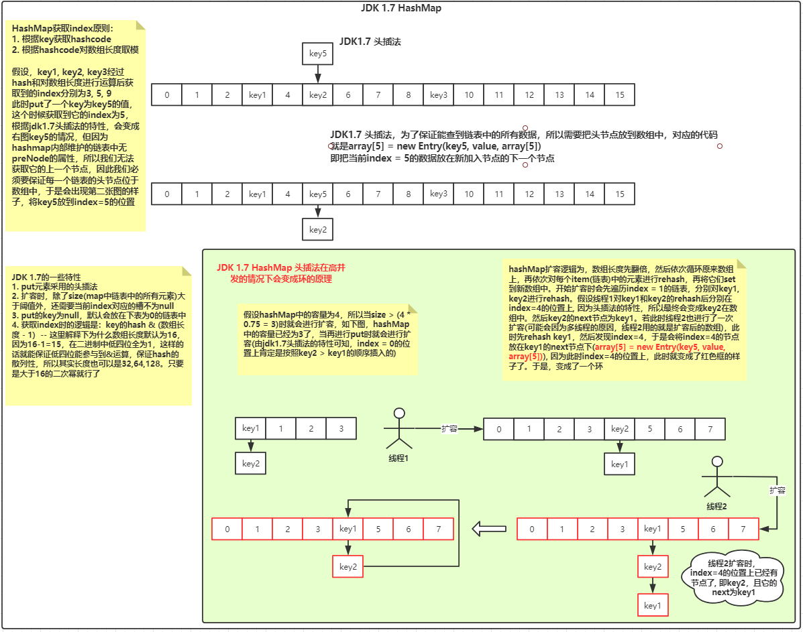

## 一、java基础相关

### 1.1 聊聊jdk的集合

#### 1.1.1 ArrayList

* ArrayList底层是一个可扩展的数组，在内存中是一段连续的空间，所以查询效率比较快。当我们默认new一个ArrayList时，`默认的数组容量是10`，同时我们也能指定数组长度，但这只是定义了数组的一个长度，并不是它的实际长度。它的实际长度是由它内部一个叫size的属性维护的。在调用它的add方法时，首先会去判断容量是否足够，size + 1的长度大于数组的长度时，此时就会进行扩容，**扩容为原来的`1.5`倍**，然后把原来的数组copy过去。`arrayList添加元素至指定下标的add方法和remove方法都是通过移动数组的方式实现的`。当需要把某个元素插入到某个下标时，arrayList是将当前下标及其后面的所有元素都往后挪一个位置。就是将数组拷贝到index + 1的位置上。remove时也差不多，是将index + 1以及后面的所有元素copy成一个数组，然后把这个数组放在index的位置上，完成remove操作。
* 同时`ArrayList的迭代器是fast-fail`（见源码：java.util.AbstractList#modCount），当我们在使用迭代器遍历的过程中若直接对数组进行了remove操作，此时会抛出ConcurrentModifiedException，此时我们应该要使用`迭代器`来执行remove操作来避免此异常的发生。它是非线程安全的，所以在多线程中，我们可以选择**vector、Collections.synchronizedList()和juc包下的CopyOnWriteArrayList**; 前两者差距都差不多，都是在方法处添加了synchronized关键字保证同步，而juc下的CopyOnWriteArrayList保证线程安全的原理是：内部使用了**ReentrantLock来保证线程安全，换言之就是使用AQS保证的线程安全**。同时`vector扩容是原来的两倍`，跟ArrayList不同。

#### 1.1.2 HashMap & ConcurrentHashMap

* Hash表，是一个时间复杂度为O(1)的数据结构，在等值查找的过程中具有特别大的优势。在jdk 1.7版本中，HashMap内部结构是**Hash表 + 链表**组成的，也就是俗称的`拉链法`。在jdk1.7中，一个hashMap默认的大小为**16**，扩容负载因子为**0.75**（**`引发问题1：扩容负载因子为什么是0.75`**），即当集合中的元素大于阈值**16 * 0.75 = 12**时，将要进行扩容，扩容为当前长度的**2倍**，此时因为jdk1.7在put元素采用的是头插法，这就导致如果在扩容的那一瞬间有多个请求同时对hashMap进行扩容，此时就会出现**环**的情况，即出现死循环（**`引发问题2：描述生成环的细节？`**）。在扩容的过程中，需要对原来的hashMap中的数组中的元素进行**rehash**，因为使用hash会出现hash碰撞的问题，jdk的作者为了将数据均匀分布在hash表中，特意设计了一个hash算法: 调用key的hashCode（**`引发问题3：为什么重写了HashCode后还要重写equals方法？`**）方法做完一系列操作后得出一个hash值最后再与hashMap的默认长度减一(`16 - 1 = 15`)做&运算得出要放入新hash表中的下标。其中hashMap的长度也支持自定义，但是我们最好把它的长度设置成2的幂次方。因为(2的幂次方 - 1)得出的结果的二进制中低四位全为1，这样的话hash的结果完全取决于key的hash值，这就达到了hash均匀分布的效果。

* 在jdk1.8中，针对上述的高并发下会出现环、以及链表查询效率低的情况做了改进。首先的改进为：put元素的方式从头插法变成了尾插法，以及对链表的数据结构进行扩展。**当链表的长度大于8且数组的长度&gt;64**，才会转成红黑树（**`引发问题4：为什么使用红黑树？`**）。但是即使换成了尾插法，但是仍然不建议在高并发的情况下使用HashMap，就算避免了出现死循环的情况，但是仍然不可避免数据的线程安全。在高并发的情况下最好使用juc包下的ConcurrentHashMap。

* 在jdk1.7中，ConcurrentHashMap采用的是segment分段锁来保证线程安全的，为什么说segment是一个锁呢？因为它继承了ReentrantLock类，在ConcurrentHashMap中，数组中存储的是segment对象，而segment对象内部维护了一个叫HashEntry的数组，其实我们可以把HashEntry理解成hashMap中的hashEntry，内部的逻辑和hashMap类似。而在jdk1.8中，ConcurrentHashMap放弃了segment分段锁，选择了synchronized + cas的方式来保证线程安全（**`引发问题5：为什么1.6之后改用成synchronized关键字保证线程安全？`**）。

  > 1. **`引发问题1：扩容负载因子为什么是0.75`**
  >
  > 2. **`引发问题2：描述生成环的细节？`**
  >
  >    
  >
  > 3. **`引发问题3：为什么重写了HashCode后还要重写equals方法？`**
  >
  >    这里拿hashMap做个例子，在hashMap中，是基于key的hashCode的值做了一些处理得出了index，但是hashCode是一个hash算法，难免会出现hash碰撞的情况。当出现hash碰撞后，得到的都是同样的下标，那么我们要如何来区分现在存在index的元素和我现在正在要put的元素是否相等呢？没错，就是使用equals方法来判断。hashcode只能说明当前对象的hashcode值，并不能代表对象相同。
  >
  > 4. **`引发问题4：为什么使用红黑树？`**
  >
  >    因为hashMap作为一个优秀的集合，会有频繁的插入和查找的特性，插入效率最好的是链表，而对于链表的进化数据结构而言查询效率比较好的完全平衡二叉树，而红黑树就位于这两者之间
  >
  > 5. **`引发问题5：为什么1.6之后改用成synchronized关键字保证线程安全？`**
  >
  >    因为jdk在1.6之后对synchronized关键字做了优化，它有一个锁升级的过程

* 更多关于hashMap的八股文，详见[此文章（点击查看）](https://mp.weixin.qq.com/s/7I-5RL0Py-g8mP7lJol3Yg)

#### 1.1.3 基本思路

* 首先说底层的数据结构以及数据结构上的特性 -> 再说无参构造方法内部的一些默认值属性 -> 再说往集合中添加元素的原理 -> 再说扩容的情况 -> 再说线程安全的情况 --> 再说如何保证线程安全

### 1.2 创建对象的几种方式

* new、反射、反序列化、clone、使用unsafe类

### 1.3 深拷贝与浅拷贝

* **浅拷贝：**创建一个新对象，然后将当前对象的非静态字段复制到该新对象，如果字段是值类型的，那么对该字段执行赋值；如果该字段是引用类型的话，则复制引用但不复制引用的对象。因此，**原始对象及其副本引用同一个对象**。
* **深拷贝：**创建一个新对象，然后将当前对象的非静态字段复制到该新对象，无论该字段是值类型的还是引用类型，都复制独立的一份。当你修改其中一个对象的任何内容时，都不会影响另一个对象的内容。
* **总结：**深拷贝中，两个对象互相独立，毫无任何关系。浅拷贝中，引用对象拷贝的是引用，指向的还是堆内相同的对象。

### 1.4 并发相关

#### 1.4.1 有哪些锁的种类

| 锁种类   | 特性                                                         |
| -------- | ------------------------------------------------------------ |
| 悲观锁   | 悲观锁的特点是认为无时无刻都会出现并发的情况，所以每次都会加锁 |
| 乐观锁   | 乐观锁的特点是认为每次执行的过程中都不会出现并发的情况       |
| 可重入锁 | 锁的可重入性，即获取到锁的线程可以再次进入相同锁锁住的同步代码 |
| 自旋锁   | 所谓自旋锁就是让一个线程空转，jdk中使用for(;;)的语法。其实就是个死循环，当拿到锁后再跳出循环 |
| 轻量锁   | 多个线程交替执行，比如synchronized关键字的轻量锁、reentrantLock的轻量锁。所谓轻量锁就是一个概念，一种情景：关键就在于多个线程交替执行。<br/>为什么说ReentrantLock也是个轻量锁呢？若有两个线程交替使用reentanctLock的lock方法，此时aqs队列都没初始化，仅仅是交替抢占state资源 |
| 偏向锁   | 所谓偏向锁就是这把锁只偏向于一个线程。在jvm中偏向锁的功能默认是延迟4s的，可以添加**-XX:BiasedLockingStartupDelay=0**jvm参数来设置延迟加载为0或者在创建锁对象之前延迟4s。其中使用**-XX:+PrintFlagsFinal**参数可以查看到jvm中对偏向锁功能默认延迟的时间 |
| 重量锁   | 重量级锁为在一个线程持有锁的过程中，另外一个线程也来申请获取锁了，此时存在资源的竞争情况。 |

#### 1.4.2 cas是什么

* 全称Compare And Swap，是一种乐观锁。主要原理为：**依赖硬件层面的原子性来实现并发操作**。假设要对一个变量的值由1改成5.那么在更改的过程中，会对a做比较，假设a的值不是1，那么则不会做任何操作。反之将它修改为5。其中比较和替换是原子性操作，也就是说在比较的过程中或者比较完准备赋值的步骤中不会出现其它线程来赋值的操作。但这会引发**`ABA`**问题，假设线程A把1改成了5，线程B又把5改成了3。线程C又把3改成了1。要解决这个问题可以使用拥有版本号的Atomic类，比如**AtomicStampedReference**类，为每个版本添加了时间戳，这样就能知道变量有没有被改过了。cas适合并发量比较低的场景，因为cas会频繁的占用cpu的资源，是很耗cpu性能的。

#### 1.4.3 synchronized原理

* 首先synchronized关键字有三种使用方式：添加到代码块、实例对象、类对象。添加到代码块（指定同步代码块，并指定一个锁对象）中锁住的是当前锁对象，添加到实例对象（在实例方法中添加synchronized关键字）中。锁住的是当前实例对象。添加到类对象中（在static方法中添加synchronized关键字），锁住的是当前的Class对象。其实现原理是：当jvm把java类编译成class字节码文件时，会为synchronized关键字修饰的代码块添加一个**monitorenter**和**monitorexit**指令，这个指令为jvm的一个规范，具体的功能由具体的虚拟机去实现(**eg: hotspot，jrockit, j9等等**)，在hotspot中，此指令在底层对应的是一个叫moniter的对象，内部维护了一个**wait_list和entry_list**(只有在这个队列中的线程才有资格竞争cpu资源)，当我们在调用锁对象的wait方法时，会将当前线程放入wait_list中去，当调用notify时，会从wait_list中随机找出一个线程放入entry_list中去，当调用notifyAll方法时，会将wait_list中所有的线程都放入到entry_list中，再由cpu来随机调度，因此它是一个**`非公平锁`**。同时，在jdk1.6之前，**monitorenter**和**monitorexit**指令在底层对应的实现就是调用os系统的函数(**mutex中的函数**)，因此它是一个重量级锁。而在jdk 1.6之后，jvm对synchronized关键字进行了优化，添加了**偏向锁、轻量锁、重量锁**。
  下面将从两个方面来介绍锁升级过程:
  1. 当一个对象是在jvm启动4s后创建的，此时这把锁是一个可偏向状态(是指这把锁是一个偏向锁，但是他没有具体的偏向具体的线程)。当只有一个线程来对持有锁时，这时这个锁会具体的偏向于一个线程(**在偏向锁时，只会调用一次操作系统函数，后续在获取锁的过程中，jvm若发现当前锁是一把偏向锁并且偏向是同一个线程，那么此时就直接获取锁，不需要再调用操作系统函数，这也说明synchronized是一把`重入锁`**)。当有第二个线程来获取锁时，此时它会升级为轻量锁，若有多个线程竞争锁激烈，那么jvm会将锁升级成重量级锁。同时在偏向锁功能生效的情况下， 若一个可偏向状态的锁调用了它的hashcode方法，此时第一个线程去获取锁时，它不再是偏向锁，而是升级为轻量锁了。因为偏向锁和hashcode是互斥的，因为他们两都是使用对象头的同一块区域存储信息的。
  2. 当一个对象是在jvm启动后前4s创建的，此时它是处于无锁状态。当只有一个线程持有锁或者多个线程交替执行时，这把锁为轻量锁。在轻量锁当中，锁会做自动释放的操作，也就是轻量锁在获取锁和释放锁的过程中都会调用操作系统的函数。若线程不是交替执行，而是有激烈的竞争行为时，此时会膨胀成重量级锁，此时的锁就是一把重量级锁。同时synchronized关键字还具有`重偏向`和`重轻量`的特性。
     所谓`重偏向`是指同一个类型的锁升级轻量锁的次数达到了**20**，那么就会**将后面相同类型的锁批量重偏向于当前线程**。
     所谓`重轻量`是指同一个类型的锁升级轻量锁的次数达到了**40**，那么就会**将后面相同类型的锁批量升级为轻量锁**。
* 思路：使用synchronized的三种方式 --> 过度到底层jvm编译后的指令 --> 在讲到底层wait_list(调用锁对象的wait方法时进入这个集合)和entry_list(调用notify、notifyall方法时进入这个集合，只有在这个集合中的对象才有资格竞争cpu资源)的数据结构 -> 

#### 1.4.4 juc包下有哪些可以保证线程安全的工具

* aqs系列的ReentrantLock、cas系列的atomic、调用底层操作系统系列的unpark和park

#### 1.4.5 aqs的原理

* aqs的原理主要是一个clh的双端队列，然后有一个volatile修饰的共享资源state变量。当有多个线程去抢夺这个资源时，对于state的线程同步机制主要是依靠cas和park/unpark实现的。在双端队列中，位于队首的元素内部保存了拥有当前state使用权的线程信息，而后面的元素则要挨个排队。对于aqs而言，它只是抽象出来了这么一个思想。

#### 1.4.6 ReentrantLock和synchronized的区别

* 首先，synchronized是jvm层面的一个关键字，所有的加锁、释放锁的操作都是jvm帮我们做的。而ReentrantLock需要显示的编码lock和releaseLock。Synchronized关键字可以把锁加在代码块、实例、class类对象上。而ReentractLock只能加在代码块上。同时，他们都是拥有可重复的特性。但ReentrantLock更高级，它可以显示的指定公平锁和非公平锁，以及还有一些高级api特性condition。除此之外，它还有一个特性就是：一朝排队，永远排队，这和它底层tryAcquire方法的设计有关系，如果是非公平锁的话，在加锁的过程中，会尝试去抢夺一次锁，如果是公平锁的话，则是直接入队列。Synchroinzed的话，它还有一个锁升级的过程，是一个偏向锁、轻量锁、重量锁的升级过程，并且是不可逆的。

#### 1.4.7 volatile关键字底层做了什么事情

* volatile是jvm层面的一个关键字，它拥有可见性的特性。它的可见性依赖于JMM的内存模型（主要保证了**原子性、可见性、有序性**），在现代操作系统中，cpu的运行速度是非常快的，为了满足cpu运行时需要的数据，在底层会设计l1、l2、l3三个缓存。在我们的JMM模型中，有一个主内存的概念，在主内存中存放的就是线程间共享的变量，每个线程在工作时，会将主内存的数据拷贝一份到自己的工作内存中去，若后续由线程修改了自己的数据，此时会通知到主内存，刷新主内存的数据，同时，volatile会在这里保证其他的线程对这次数据的更改是可见的。这就是它的可见性。除此之外，它还有指令重排的特性。但它不具备原子性，因此，如果想要原子操作的话，可以使用线程同步的方式来保证。

#### 1.4.8 对象头有多大

* 总共有128位，其中mark word占用64位，其中包含一些54位的线程信息、2位的偏向时间戳、1位未被使用、4位的分代年龄、1位的偏向锁标识、2位的锁标识

### 1.5 线程相关

#### 1.5.1 线程池有哪些参数

* 主要有核心线程数、最大线程数、存放任务的队列、生成线程的线程工厂、闲置线程数的存活时间、闲置线程数的存活时间单位、队列和最大线程数满了之后的拒绝策略，其中拒绝策略包含直接丢弃、丢弃最旧的一条、直接抛异常、由调用者所处的线程直接调用

#### 1.5.2 当核心线程数都在工作时，新提交了一个任务，线程池是怎么处理的？

* 当核心线程数都在工作时，新提交了一个任务，此时会将任务放在队列中去，当队列满了之后，就会使用线程工厂创建线程池去消费队列中的任务，工作线程数达到了最大，并且队列也满了之后，此时会执行拒绝策略。
* **corePoolSize -> 任务队列 -> maximumPoolSize -> 拒绝策略**

#### 1.5.3 线程池的核心运行参数和最大运行参数是如何设置的

* 看应用的类型。如果是cpu密集型的任务，会大量耗费cpu的性能，比如大量的计算、图片压缩、递归计算、java规则引擎等等都是非常耗费性能的，如果是这种应用，我们需要将核心运行参数设置成cpu核心数的两倍。此时如果设置的过大的话，会出现上下文的切换，比较耗性能。
* 如果是io密集型的任务，因为io密集型的任务他的特点是比较耗时，但是cpu的利用率反而没那么高，此时可以将线程数设大一点。
* 通常有这么一个公式来决定：最佳线程数 = cpu核心数 * （1 + IO耗时/CPU耗时）。由这个公式也可以看出，如果是io密集型的应用，IO耗时过大，进而会导致最佳线程数增加。如果是cpu密集型，cpu耗时过大的话，会导致最佳线程数减少。

#### 1.5.4 ThreadLocal是什么？它的使用场景？

* ThreadLocal的另外一个名称是：**线程变量**。什么意思呢？这说明这是我们线程独有的变量，每个线程拥有自己的一份，天然的线程安全工具类。在我们的应用中，比如使用ThreadLocal记录当前的用户信息，然后在这个请求中的任意一个地方使用get使用即可（但不能在其他线程中使用）

#### 1.5.5 ThreadLocal的底层原理是什么？

* 其底层是个ThreadLocalMap，存储在当前线程对象中，但是我们有可能在同一个线程中往ThreadLocal中存储不同类型的数据，比如Spring的TransactionSynchronizedManager。因此，它底层其实使用的是一个数组存储ThreadLocalMap的。

#### 1.5.6 ThreadLocal是线程变量，我们知道线程有自己的栈空间，存储的是自己变量，那ThreadLocal内部的值是放在jvm的堆里还是栈里？

* 其实，ThreadLocal也是一个类，是我们自己new出来的，那它当然是存在堆里的呀。我们只是通过了一些特殊手段，来保证只有当前线程能访问到自己的数据

#### 1.5.7 如果我现在有个ThreadLocal被线程A持有，我现在想在线程B中使用这个ThreadLocal，可以吗？

* 可以。但需要满足两个条件：1、线程A持有的ThreadLocal为可继承的ThreadLocal。 2、线程B必须为线程A的子线程

#### 1.5.8 ThreadLocal有哪些缺点？

* 由于ThreadLocalMap实现了弱引用的接口，因此在JVM进行GC操作时，会将弱引用的对象回收掉，这就会导致ThreadLocal内部数组中的元素的key为null，但是value有值的情况。如果这个线程最终会返回线程池的话，那这个属性就会一直存在，最终会导致OOM。因此，我们在线程使用结束后，应该要调用remove方法，情况当前的线程对应的数据。

#### 1.5.9 创建线程有哪几种方式？

* 一共四种：**thread、runable、线程池、callable && futureTask**

#### 1.5.10 wait和sleep方法的区别

* 两者都会挂起当前线程，区别是：wait方法会释放当前拥有的锁，而sleep方法不会。

#### 1.5.11 线程的状态有哪些？

* New，创建一个新线程时的状态
* Runnable，线程准备就绪状态，等待CPU调度
* Blocked，阻塞状态，因为公共资源被其他线程占有了导致的阻塞
* Waiting，无限期的等待状态
* TimeWaiting，有超时时间的登台
* Terminal，线程的终态

### 1.6 final关键字修饰的变量可以在构造方法中初始化吗？

* 可以，如果final修饰的变量没有赋初始值的话，那构造方法需要携带每一个final修饰变量个数参数的构造方法。即，final修饰的变量有5个的话，那构造方法就得有5个参数，并且内部都要为这些变量赋值。

### 1.7 java反序列化的原理

* java反序列化也是一种创建对象的方式，但是它并不会调用构造方法，是由JVM自己生成的对象

### 1.8 String、StringBuffer、StringBuilder的区别

* String内部是由char类型的数组构成，使用了final修饰，是不可变对象，线程安全；对String进行改变时每次都会生成一个String对象

### 1.9 JDK动态代理

* 主要两个类，分别是InvocationHandler和Proxy类。前者是要被代理的逻辑，也可以称作为增强逻辑。

### 1.10 JVM相关

#### 1.10.1 JVM内存结构

* JVM包含两大块，分别是线程私有和线程共享区域。其中，栈内存中的数据是线程私有的，分别有**程序计数器，虚拟机栈，本机方法栈**等信息，方法的执行对应着入栈和出栈的过程

* 而线程共有的区域有两块，一个是方法区、还有一个是堆。在方法区中，存放的是已被加载的类信息、常量、静态变量、即时编译器编译后的代码等信息。JDK1.8中方法去被元空间取代，使用直接内存。另外一个区域是堆，堆内是jvm中最重要的一块区域，我们所有new出来的对象都是放在堆里的，同时所有的GC也是发生在堆。在堆中，**分为新生代和老年代，其占用堆内存的比例为1:2。其中在新生代中，又分为eden区、servivor from区、servivor to区，占用比例为8:1:1**。当eden区的内存满了之后，会进行一次minor gc，会采用GC Roots（根可达分析算法）来筛选出非垃圾对象，再到Eden区取交集，交集中的对象会被复制到servivor的from区，剩下的非交集对象则会当做垃圾被处理。当Eden区第二次满了之后，同样会进行根可达分析算法，找出被引用到的对象，然后与eden区和s1区的对象取交集，再将结果复制到servivor的to区，再清楚剩余的垃圾。所以每次minor gc时，结束后eden区会清空已经survive区的from和to区一定会有一个为空的情况。当一个对象经历了15次minor gc还未被清理时，则会把它移动到老年代中去。如果老年代满了之后，则会触发full gc，进而触发stop the world机制，此时jvm会启动一个线程来专门处理full gc，并挂起用户线程，这将会导致用户在页面中出现卡顿的情况，如果老年代经过full gc后依然满的话，则会触发OOM

* 其对应的内存图如下所示：

  

  堆内存结构：

  

  

#### 1.10.2 双亲委派机制

* 参考下图类加载原理

  

#### 1.10.3 类加载器

* |          类加载器类型          |                      作用                       |                           获取方式                           |                   备注                   |
  | :----------------------------: | :---------------------------------------------: | :----------------------------------------------------------: | :--------------------------------------: |
  |   系统加载器(AppClassLoader)   | 加载当前应用`classpath`下的class文件至jvm内存中 | ClassLoader appClassLoader = ClassLoader.getSystemClassLoader() | 线程上下文获取的类加载器就是`系统加载器` |
  |   扩展加载器(ExtClassLoader)   | 加载`%JAVA_HOME%/jre/lib/ext`路径下的所有jar包  |   ClassLoader extClassLoader = appClassLoader.getParent()    |                    无                    |
  | 根加载器(BootstrapClassLoader) |   加载`%JAVA_HOME%/jre/lib`路径下的所有jar包    |   ClassLoader rootClassLoader = extClassLoader.getParent()   |  在java中获取的为null, 因为是由C++写的   |

#### 1.10.4 全盘委派机制

* 如何将一个java文件加载到jvm内存？大致能想到的就是使用jdk自带的api：`Class.forName("全限定名")`。但是使用这个api有一个特点，就是内部有这么一段代码：
	```java
	public static Class<?> forName(String className)
	                throws ClassNotFoundException {
	    // 拿到调用方的Class类，假设在类A的main方法中调用了Class.forName("com.xxx.xxx");
	    // 那么获取到的调用方的Class类就是类A  <==>  caller就是A的class对象。
	    // 最终会使用类A的类加载器将com.xxx.xxx类加载到jvm中 <==> ClassLoader.getClassLoader(caller)
	    Class<?> caller = Reflection.getCallerClass();
	    return forName0(className, true, ClassLoader.getClassLoader(caller), caller);
	}
	```
	由上述代码可知，**在类A调用了Class.forName这个api，用的就是类A的类加载器来加载类。这就是全盘委派机制**。

#### 1.10.5 jvm有哪些垃圾回收器

* 有CMS和G1。其中cms是支持并发的垃圾回收器。因为full gc时通常会触发stop the world机制，会让用户线程挂起，暂停工作。如果你想让这个暂停时间缩短的话，可以使用CMS垃圾回收器，内部会采用多线程的机制来快速的完成来清理工作。它的垃圾回收步骤是先标记写GC Roots能关联到的对象，然后在GC roots查找的过程中会与用户一起工作，这也就是它并发标记的过程，并发清理垃圾。
* 第二种是g1垃圾回收器，它是**面向服务端应用**的收集器，能充分利用多核cpu的优势。因此它是一款支持并发和并行的收集器。同时它可以预先设置stw的时间。
* 在java中可作为GCRoots的对象可以是：**引用对象、静态属性、常量、本地方法区的变量**

#### 1.10.6 有哪些方式可以确定某个对象是一个垃圾？

* 引用计数器和GC Roots可达性分析算法。前者会出现循环引用的情况。后者是比较常用的一种确定对象是否为垃圾的算法，**其中有静态变量、方法区的常量、本地方法栈的变量可以作为GC Roots对象**

#### 1.10.7 JVM有哪些垃圾回收算法？

* 标记清除算法，它主要是依据GC Roots算法识别出来的垃圾对象添加标识，然后清除。这样的操作会导致内存中有许多的内存碎片
* 标记复制算法：是标记清理算法的改进版，可以解决标记清除算法的缺点，将垃圾标记出来后，会将非垃圾对象移到一块新内存中去，再将垃圾对象清除掉。但是它浪费了一半的内存空间。与surivor区新生代的young gc的过程类似
* 标记整理算法：每次标记一个垃圾对象时，就把整理到一侧，这样的话，最终内存会分为两块区域，一个是垃圾对象区域，另外一个是非垃圾对象区域。最终清理时，只需要处理垃圾对象区域的垃圾即可。适用于老年代的算法
* 最后一种是分代收集算法，结合了上述所有的算法，是比较普遍的一种回收算法。

### 1.11 IO相关

#### 1.11.1 什么是BIO、NIO、AIO

* BIO: 请求会阻塞等待
* NIO：接收请求，异步处理，不阻塞

#### 1.11.2 select、poll、epoll的区别

* select、poll、epoll是操作系统层面的核心函数，是java selector组件的一些实现。在windows操作系统中只支持select，而在linux系统中，通常使用的都是epoll。关于select、poll、epoll的核心实现，我们得先了解下用户空间、内核空间、文件描述符fd。用户空间和内核空间其实是操作系统内部的一些保护机制，我们运行的应用通常就是在用户空间上运行的，而内核空间是属于操作系统的空间，我们的用户空间是无法直接访问到操作底层的一些硬件的，所有与硬件的交互必须经过内核空间。而文件描述符fd是指当程序打开一个文件或者创建一个文件时，内核就会返回给进程一个文件描述符fd。
* 有了上面的概念后，我们来解释下select、poll和epoll
* select是指：内部会维护一个文件描述符fd的集合。会将所有连接到selector的channel全部拷贝到内核空间，由内核来激活socket连接，然后再通过这些socket来完成一个IO操作。它有一个缺点：就是在channel多的情况下，都需要将channel都拷贝到内核态，这是一个比较大的开销。并且这个集合有一个最大的长度，64位的操作系统中，最大为2048
* poll机制与select机制差不多，内部也有一个集合，只不过是对这个集合进行了优化，这个集合并没有最大限制了。因此，它是解决了select存储文件描述符集合的容量限制问题。
* epoll（event poll）就是将select的问题完全解决了，在poll机制的前提下，将用户态的文件描述符集合全量更新到内核态的这个过程耗费的性能给解决了。它内部是基于一个事件机制来实现的，类似于发布订阅的思想，每次发布的事件，只会将当前io相关的文件描述符拷贝到内核态中去。

### 1.12 线程cpu飙升，如何快速定位问题

* 首先通过top命令找到使用cpu频率最高的进程，然后找到内部占用cpu的线程，找到它的id后转化成16进制，然后利用jstack命令把当前线程的堆栈信息找出来，进而找到对应的线程以及对应的代码所在的行

## 二、Dubbo

### 2.1 Dubbo支持哪些协议，每种协议的应用场景是什么，优缺点？

* Dubbo：单一长连接NIO异步通讯，适合**大并发小数据量**的服务调用，以及消费者远大于提供者的情况。
* rmi：采用JDK标准的rmi协议实现，传输参数和返回参数对象需要实现Serializable接口，使用java标准序列化机制，使用阻塞式短链接，传输数据包大小混合，消费者和提供者个数差不多，可传文件。
* webservice：基于WebService的远程调用协议，提供和原生WebService的操作。多个短链接，基于HTTP传输，同步传输，**适用于跨语言调用**
* http：基于http表单提交的远程调用协议，使用Spring的HttpInvoke实现。多个短连接，**提供者个数多于消费者**额情况使用
* memcache：
* redis：
* hessian：

### 2.2 Dubbo的超时时间怎样设置？

* Dubbo的超时时间有两种设置方式，第一种是在服务提供者设置超时时间，另外是在服务消费者设置超时时间，当两者都设置超时时间的话，以消费者的为准。

### 2.3 Dubbo支持哪些注册中心

* Multicast注册中心：基于广播的机制。基于网络中组播传输实现。通过路由器和交换机来广播连接到当前路由器的所有主机。
* Zookeeper注册中心：基于分布式协调系统Zookeeper实现，采用Zookeeper的watch机制实现数据变更。
* Redis注册中心：基于redis实现，采用map的数据结构存储，主key存储服务名和类型，内部每一个对象中key存储的服务URL，value为服务的过期时间。基于redis的发布/订阅模式通知数据变更

### 2.4 Dubbo集群的负载均衡策略有哪些

* 随机、轮询、一致性hash、最少活跃调用。
* 随机：随机选一台服务提供者
* 轮询：依次轮询每一个服务提供者
* 一致性hash：同样的ip请求在同一个服务提供者中
* 最少活跃：每次请求时，筛选出被调用次数最少的节点。

### 2.5 Dubbo是什么

* Dubbo是一个分布式、高性能的RPC框架，提供服务自动注册、自动发现等高效服务治理方案，可以和Spring无缝集成

### 2.6 Dubbo的主要应用场景

* 服务自动注册与发现，不再需要写死服务提供方地址，注册中心基于接口名查询服务提供者的IP地址，并且能够平滑添加或删除服务提供者。

### 2.7 Dubbo的核心功能

* Remoting：网络通讯框架，提供对多种NIO框架抽象封装，包括“**同步转异步**”和“请求-响应”模式的信息交换方式
* Cluster：服务框架，提供基于接口方法的透明远程调用，包括多协议支持，以及软负载均衡（以程序的方式来模拟硬件层面的负载均衡），失败容错，地址路由，动态配置等集群支持
* Registry：服务注册，基于注册中心目录服务，使服务消费方能动态的查找服务提供方，使地址透明，使服务提供方可以平滑增加或减少机器。

### 2.8 Dubbo的核心组件

* Provider：服务暴露者
* Consumer：服务消费者
* Registry：服务注册于发现的注册中心
* Monitor：统计服务的调用次数和调用时间的监控
* Container：服务运行容器

### 2.9 Dubbo服务注册与发现的流程

* 1、服务提供者绑定指定端口并启动服务

* 2、提供者连接注册中心，并将本地IP、端口、应用信息和提供服务信息发送至注册中心存储

* 3、消费者连接注册中心，斌发送应用信息、所求服务信息至注册中心

* 4、注册中心根据消费者所有服务信息匹配对应的提供者列表发送至服务提供者应用缓存

* 5、服务消费者在发起远程调用时基于缓存的消费者列表使用负载均衡策略选择一台服务提供者发起调用。

* 6、服务提供者状态变更会实时通知注册中心、在由注册中心实时推送至消费者，更新消费者本地缓存的服务提供者信息

* 这么设计的原因

  ```txt
  1、服务消费者与提供者解耦，双方都可以横向增减节点数
  2、注册中心本身可以做集群，可动态增减节点，并且任意一台宕机后，将自动切换到另一台
  3、去中心化：双方不直接依赖注册中心，即使注册中心全部宕机，短时间内也不会影响服务的调用（因为本机有对服务提供者的缓存）
  4、服务提供者无状态，任意一台宕机，不影响使用
  ```

### 2.10 Dubbo的架构设计

Dubbo一共划分为10层

* 服务接口层：位于最上面一层，也是我们接触最多的一层，消费者和提供者都位于这一层
* 配置层：对外配置接口，以ServiceConfig和ReferenceConfig为中心。一个是服务暴露相关的配置，一个是服务引用的相关配置
* 服务代理层：服务接口透明代理，生成服务的客户端
* 服务注册层：封装服务地址的注册于发现，以服务URL为中心
* 集群层：封装多个提供者的路由及负载均衡，并桥接注册中心，以Invoker为中心
* 监控层：RPC调用次数的调用时间和监控
* 远程调用层：封装RPC调用，以Invocation和Result为中心，扩展接口为Protocol、Invoker和Exporter
* 信息交换层：封装请求响应模式、同步转异步，以Request和Response为中心
* 网络传输层：抽象mina和netty为统一接口，以Message为中心

这里说它分为10层，我倒觉得可以分为如下几大模块：1、服务接口模块。2、配置模块  3、注册中心模块 4、集群模块 5、监控模块 6、远程调用模块


### 2.11 Dubbo有哪些容错机制

* **Failover Cluster**（默认）：失败自动切换，当失败后尝试调用其他服务提供者（默认重试两次）
* Failfast Cluster：快速失败，失败即抛异常
* Failsafe Cluster：失败安全，出现异常时，直接忽略。
* Failback Cluster：失败自动回复，后台记录失败请求，定时重发
* Forking Cluster：并行调用多个服务器，只要一个成功即返回。
* Broadcase Cluster：广播所有的提供者，逐个调用，任意一台报错则报错。通常用于通知所有提供者更新缓存或日志等本地资源信息。

### 2.12 Dubbo支持哪些序列化方式

* 默认使用Hessian序列化，还有FastJson、java自带的序列化

### 2.13 Dubbo调用超时问题怎么解决

* 首先Dubbo调用超时，仅仅是断开了连接，但服务提供者的执行流程依然在执行中。在默认的情况下，Dubbo在调用服务不成功时，默认是会重试两次的

### 2.14 Dubbo如何实现优雅的停机

* 基于JVM的shutdownhook实现的，同时我们要使用kill命令而不能使用kill -9命令来关闭程序

### 2.15 注册了多个同样的服务，如何测试指定的某一个服务？

* 第一种：点对点直连，绕过注册中心。第二种：如果指定的服务有一种特殊标记时，可以添加指定的负载均衡策略，比如我们本地环境与开发环境是打通的，如果我们本地在做开发时，可以设置成优先调用本地的服务。

### 2.16 当一个服务接口有多种实现时怎么做？

* 可以添加Group来分组，服务提供者和消费者位于同一个Group即可。也可以添加verison，消费者指定要调用哪一个版本的服务即可。或者使用泛化调用

### 2.17  Dubbo服务之间的调用时阻塞的吗？

* 默认是同步等待结果阻塞，支持异步调用。如果是异步调用的话，最终会返回一个Future。

### 2.18 Dubbo如何优雅停机

* Dubbo是通过JDK的shutdownHook来完成优雅停机的，所以如果使用kill -9 命令强制关闭进程的话，是不会优雅关机的，只有通过kill命令才能实现优雅关机。而Dubbo底层在shutdownHook的回调中，会执行线程池的shutdown函数，同时将应用标记为不接受请求的状态，然后等待内部线程处理完成，如果超过了等待的最大时间，最终也会将线程强制下线，直到这些操作都停止后，才会将应用下线。

### 2.19 服务提供者能实现失效提出的原理是什么？

* 依赖于Zookeeper的临时节点原理，当zookeeper ping不通服务提供者时，这时会将它踢下线，并将节点删除，同时广播给所有的服务消费者，告知它们这个节点下线了。

### 2.20 服务读写推荐的容错策略是怎样的

* 读操作建议使用Failover失败自动切换策略，默认重试两次其他提供者
* 写操作建议使用Failfast快速失败策略，调用失败则立即报错 

### 2.21 Dubbo的控制台能做什么

* 路由规则、动态配置、服务降级、访问控制、权重调整、负载均衡等管理

### 2.22 Dubbo的服务暴露流程

* Dubbo服务的暴露过程，我给它归纳成了三个阶段
* 第一个阶段，我称它为**构建ServiceBean阶段**：首先Dubbo在启动的过程中，会扫描我们的@Service注解，Dubbo认为它就是一个需要被暴露的服务。然后会将当前的服务信息与ApplicationConfig、ProtocolConfig、RegistryConfig等信息一起封装成一个叫ServiceBean的类。这个是一个spring的bean，它内部实现了Spring的initailingBean和applicationListener的扩展点。
* 第二个阶段，我称它为**组装URL阶段**：当ServiceBean构建完成后，会回调InitializingBean的afterPropertiesSet方法，在这个方法中会对当前服务做一些校验，最终的目的是要组装URL，这个URL包含了当前服务的所有信息，包含当前服务位于的ip、端口、请求path、使用哪种协议等等。
* 第三个阶段，我称它为**服务暴露阶段**：如果当前服务没有配置延迟暴露的话，就会在InitializaingBean的回调中进行export，若当前服务配置了延迟暴露的话，最终会在Spring容器启动完成后的contextRefreshEvent（即上下文刷新事件）中开始进行服务暴露逻辑。不管是延迟暴露还是立即暴露，都会调用到父类ServiceConfig的doExport方法，在这个方法中，首先会根据URL来确定当前服务的一些基本信息，然后会根据Dubbo的自适应扩展机制来调用合适的协议来进行导出，在导出的过程中，会使用javassit技术将服务提供者封装成一个代理对象，最终转化成一个Invoker。然后再调用RegistryProtocol的export方法来完成服务的导出，这其中会包含将URL相关的信息注册到注册中心中去，除此之外，还需要在本地开启netty服务器，并将当前要暴露的服务绑定到netty服务器中去，至此，Dubbo的服务就暴露出去了

### 2.23 在使用Dubbo的过程中有遇到哪些问题？

* 一个协议用到底，因为默认推荐的是Dubbo协议，因此在很多传输大文件的过程中会影响并发量，实际上这个时候应该用Http协议比较好。其次，在使用泛化调用时，RefrenceBean对象比较大，在并发的情况下，出现了OOM的情况。公司开发的负载均衡使用情况

### 2.24 Dubbo启动时，如果依赖的服务不可用会怎么样

* Dubbo缺省会启动检查依赖服务是否可用，不可用会抛出异常，可以通过check为false来关闭这个功能。

### 2.25 Dubbo的服务引用过程（默认懒汉式）

* Dubbo的服务引用过程，我把它归纳成了2个阶段
* 第一个阶段，我称它为**解析@Renference注解**，在这个阶段中，Dubbo会将所有spring bean内部被@Renference注解标识的属性封装成FactoryBean。
* 第二个阶段，我称它为**创建代理对象阶段**，在这个阶段中，会调用factoryBean的getObject方法，进而触发Dubbo为@Renference注解创建代理对象的逻辑。在创建代理对象的时候，会向注册中心发起订阅服务的申请、获取当前服务对应的所有服务提供者的信息并缓存到本地、将自己注册到注册中心。然后也会通过javassit技术构建代理对象，并封装成Invoker，在代理对象内部封装了许多我们无感的组件，比如netty的客户端、filter、cluster等等。

### 2.26 Dubbo的spi机制是什么？java自带spi机制了，Dubbo为什么还要自己写一套

* 先说说java的SPI，它是一种提供服务的机制，我们只需要在META-INF/services文件夹内部添加文件，文件内容是每一个接口的实现类的话，可以获取到所有的实现类，但java的spi机制会全量实例化，假设我们某个类根本用不到，并且还会带来很大的资源浪费时，这都是没必要的开销。而Dubbo的spi机制在这个基础上做了改进，它支持key value的映射，并且支持懒加载，完全避免了java spi的缺点。

### 2.27 Dubbo消费者调用过程

* 一共有三个阶段：
* 第一个阶段，**消费者发起请求：**从@Renference注解引入的代理对象开始，然后从cluster中经过路由的过来、负载均衡机制选择一个invoker发起远程调用，此时会记录此请求和请求的ID，等待服务端的响应，此时会生成一个future等待响应。
* 第二个阶段，**服务端处理请求：**服务端接收到请求后，会根据参数找到合适的服务提供者，进而执行真正的实现类，并组装好结果，同时会将之前的请求ID携带上。
* 第三个阶段，**消费者处理响应：**消费者收到这个响应后，会通过ID去找之前的记录的骑牛，然后找到请求后将响应填充到future中。

### 2.28 zk集群都挂掉后，服务间还能通行吗？

* 能，因为服务消费者有个本地缓存，可以根据本地缓存进行调用。所以zk在整个dubbo环境中，就是一个协调通知的功能，主要作用是用来维护当前微服务中每个服务的一些生命周期，并能实时让服务消费者感知到。但是如果服务提供者也都挂掉的话，那服务消费者会一直重连提供者，等待提供者恢复。

### 2.29 zk如何存储dubbo生产者和消费者信息

* 以服务为基准，其中节点名为服务类的全限定名。然后内部有一些服务提供者、消费者的信息。这些节点都是**临时节点**。zk会与每一个服务进行心跳检测，如果服务有问题，zk会主动将服务下线

###  2.30 Dubbo 的工作流程


### 2.31 Dubbo线程模型

* 

## 三、网络相关

### 3.1、说说你在浏览器中请求应用服务器的一张图片时，浏览器做了哪些事、网络做了哪些事、操作系统做了哪些事？

* 这里面涉及到了网络的OSI七层协议，但是我们主要看5层就行了。首先，我们的应用都是位于**应用层**的，如果应用层要有任何交互数据时，会做一个甩手掌柜，直接将传输数据的工作交给传输层去做了。而**传输层**中大概率用的就是TCP/UDP协议来交互数据了，对于TCP而言，它有很多优点：控制流量、能确保对方收到了数据。而UDP则是不安全的，但是它可以支持海量请求。应用层发起的请求经过传输层后，传输层会对请求数据做一层封装，在头部添加了传输层相关的信息。而要想继续传递数据的话，此时就要依赖网络层了。在**网络层**中，基本上使用的就是ip协议和路由了。当一个请求到达网络层后，网络层需要知道，这个请求最终是请求到哪里去，因此，会使用到ip协议的一些特点。ip协议一共会分为两个大的部分，分别为：网络地址和主机地址。通常，会使用网络地址上的信息来确定这个请求最终会落入哪一个网点，而使用主机地址的话可以确定要请求到这个网点中的那一台机器。这对应的就是ip寻址和路由两个操作，ip寻址相当于提供了导航的功能，而路由则是我们的方向盘。因此，经过网络层后，我们是能知道这个请求要请求到哪个网点的哪个主机上了。但是我们的每台机器都不一定位于同一个网段，因此，会出现跨网调用的情况。而这个时候，就需要依赖与**数据链路层**了，在这一层中我们主要会依赖于路由器，在路由器中会存储ip和mac地址的映射，我们在网络层不是知道了要请求的ip在哪里了么，此时我们还要知道具体是哪一台电脑，而每台机器都有一个固定的mac地址，因此路由器有这么一个映射关系后，是能知道我们的请求最终要命中哪一台具体的电脑的。有了上面的应用层、传输层、网络层、数据链路层的工作之后，我们已经知道请求要落在那个电脑上了，因此，后面的步骤就是真正的传输的，因为网络中的传输都是以二进制为标准的，因此需要将我们的请求转化成二进制，而这么一个操作就是在**物理层**来实现的。这是一个请求的过程，而数据响应的过程也与这个类似。

### 3.2、HTTP有哪些优点、缺点


### 3.3、HTTPS与HTTP的区别，如何保证安全性


### 3.4 TCP/IP模型

* 四层模型：网络接口层、网络层、传输层、应用层
* 五层模型：物理层、数据链路层、网络层、传输层、应用层
* 七层模型：物理层、数据链路层、网络层、传输层、会话层、表示层、应用层

### 3.5 什么是三次握手？为什么要三次握手而不是四次握手

* 发送方 发送 SYN信号给对方
* 对方发送 ACK/SYN 信号给自己
* 自己再发送ACK信号给对方，表示可以开始进行传输数据了
* 为什么是三次握手？因为三次握手可以基本确定双方都有接收数据的能力。因为网络波动的可能性是非常大的，假设只有两次握手的话，有可能在最后一次握手中，对方并没有接收到信号，导致发送方认为这条通道是通的，造成不必要的资源浪费。

### 3.6 四次挥手

* 主动关闭方发送 fin信号 给对方
* 对方回复ack
* 对方发送fin信号给自己
* 自己回复ack
* 与三次挥手的唯一不同是在于第二步：三次握手的第二步是将ack和syn信号一起发的，但是四次挥手是分开的

### 3.7 TCP滑动窗口

* TCP拥有流量控制相关的功能，而TCP的滑动窗口就是做流量控制的。在发送方向接收方发送数据的时候，会从接收方那里得知接收方最大能接收到的数据大小。发送方在发送数据的时候，只有落入这个窗口的数据才能发送到对方去。

### 3.8 TCP的粘包拆包

* 主要产生这个原因是因为在TCP的传输过程中，为了保证传输效率最大化，一般会有一个buffer来控制传输数据的大小，如果数据比较小的话，那么会暂停发送，待buffer都被填充满了后再发送给对方。因此这里就会出现粘包、拆包的情况。如果一个数据包 > buffer时，此时会产生拆包的情况。然后在拆包的基础上，上个步骤被拆出来的包有可能跟其他数据包一起发送给对方，这个时候就是粘包的现象。为了解决这个问题，我们可以在发送端和接收端定义一种协议，比如用一些特殊符号来定会边界，来保证接收端一定能接收到完整的数据。

## 四、Redis相关

### 4.1、Redis有哪些数据结构？

* 有五种基础数据结构string、list、map、set、zset，除此之外还有hypeloglog、geo、bitmap。通常，我们可以充分利用这些数据结构，比如list可以利用它的特殊api实现栈、队列的功能。而map的话，我们可以存储一些对象的结构、购物车信息。set和zset的话，我们可以用来去重、生成随机数、取交集、差集、并集等等。除此之外，我可以用hypeloglog来实现统计功能、geo来实现定位相关的功能、bitmap来实现布隆过滤器。

### 4.2、说说Redis的缓存穿透、击穿、雪崩

* 所谓的缓存穿透、缓存击穿、缓存雪崩都是一种缓存中间件redis不生效的表现形式。所谓的缓存穿透是指：如果业务请求，请求了**大量不存在的key**，此时所有的请求都会打入DB。容易将数据库搞崩。而缓存击穿是指：**单独针对一个热点key**，如果这个key失效了，大并发的读请求也会请求到DB，这个时候DB也会扛不住，崩掉。而缓存雪崩是指：**大面积的热点key在同一时间失效**，导致所有的请求打入DB，导致DB挂掉。
* **缓存穿透**是针对于`不是热点key的情况`，而**缓存击穿**是指针对于`一个热点key，且key过期`的情况，**缓存雪崩**则是针对`大面积热点key失效`的情况

### 4.3、什么样的数据需要使用缓存

* 业界存在一个**五分钟法则**的概念，如果一份数据在5分钟内会存在多次访问的话，这个数据就需要缓存起来。

### 4.4、你在工作中的哪些场景用到了redis

* 1、透传渠道配置信息，我们每一个业务要请求哪一个具体的渠道，都是配置好的。因此，我们在发起支付时，会将渠道配置信息透传进行透传，减少业务的耦合
* 2、分布式锁。主要是保证单据的线程安全以及幂等。
* 3、批量跑批的商户号实时清分。使用到了redis中的set，对与某些特殊的经商完成支付后会将自己的商户信息写入set集合中，然后由job跑批来进行实时清分操作

### 4.5、Redis如何实现延迟队列？

* 需要在redis的配置文件中打开发布订阅功能，同时监听某一个key的过期时间。当key过期后，会通知给监听者，然后完成延迟队列的功能

### 4.6、keys命令能到生产环境上使用吗？

* 不能，因为redis是单线程的，keys命令会将所有的key都遍历出来，是一个很慢的操作，这就会导致其他的命令在排队。

### 4.7、Redis的集群有哪些？

* 主从、哨兵、redis-cluster

### 4.8、主从复制、哨兵、cluster的原理？

* 

  第一：从节点向主节点发送psync指令，目的是获取主节点的偏移量信息

  第二：主节点收到指定请求后，将自己当前数据的偏移量信息返回给从节点，同时内部会执行bgsave指令进行RDB操作

  第三：主节点为了保证bgsave时能对外提供服务，此时会在内部开启一个缓冲队列，用来存储一些跟写命令有关的操作。

  第四：主节点把同步好的rdb文件和缓冲队列中存储的写命令一起发送给从节点

  第五：从节点清除本地的数据，并开始读取rdb文件和缓冲队列中的数据，实现数据同步

* 

* 

### 4.9、如何解决哨兵模式的脑裂问题？

* 可以在配置文件中指定固定的主节点，假设1主2从的结构中，可以在配置文件中配置主节点个数为1，这样即使出现了脑裂的情况，也没关系，最终只有一个master节点向外提供写服务

### 4.10、Redis的持久化机制有哪些？

* RDB和AOF

### 4.11、为什么要开启持久化？

* 我先介绍下不开启持久化会发生什么情况吧。如果不开启持久化的话，当遇到一些无法避免的灾难性问题时，比如停电等情况，我们的redis是不能再对外提供服务了。此时，我们需要重启redis，我们知道，redis是基于内存的，主要我们一重启应用的话，内存里面的东西就会情况。这个时候，相当于一个空壳的redis在对外提供服务，此时如果有大量请求过来的话，我们的请求都会落地DB，此时DB肯定会挂。这是一个非常严重的事情。但是如果我们开启了持久化机制的话，遇到这种情况，我们重启redis后，redis能重新从磁盘中读取数据并添加到缓存中。
* 又或者，如果我们发生了灾难性的故障，比如位于北京区域的redis发生了地震，此时，如果我们有一套完整的迁移方案的话，也可以应付这样的情况。这个方案的话，可以这样做：在服务器层面定时的将redis的aof和rdb持久化文件定时同步到不同地点的指定位置，当出现这种灾难性问题时，我们可以启动其他的区域的redis来提供服务。

### 4.12、RDB和AOF的原理是什么？有什么优缺点？

* 首先RDB机制的话，redis每隔一段时间（可以配置）会在后台fork出一个子进程来将当前内存中所有的数据保存到指定的RDB文件中。因此，这种情况下，RDB机制可能导致某段时间内的数据丢失。
* 而AOF机制的话，它也是每隔一段时间（可配置）将所有相关写操作的命令保存到aof文件中去，它的时间间隔可以配置的比较小，但是还是有可能会出现丢失几秒前数据的情况。同时AOF还有一个rewrite机制，AOF文件不可能会一直保障，redis的内存是有限的，当内存达到一定高度时，会触发淘汰策略，通常使用的是LRU算法来淘汰。因此，这个时候redis内部的数据可能和AOF里面的文件对应不上了，到最后，AOF文件的重写机制触发了，此时会将redis内部所有的数据对应的写命令重新添加到新的AOF文件中去。

### 4.13、如果Redis想支持海量数据的话，此时要怎么设计？

* 此时可以使用Redis的redis-cluster集群模式，通常每一个master节点会搭配多个slave节点。并且每个master节点负责的职责是不一样的。在这种集群模式下，它结合了主从复制、哨兵模式的特点，并且拥有特殊的hash算法来支撑海量数据、也可以满足高并发、高可用的特性。

### 4.14、redis如何实现分布式锁？

* ####  使用**setnx** + **exist** + **del**

  ```markdown
  大致的流程为:   先setnx，若返回1(setnx命令返回的是1)则表示加锁成功。然后去处理正常逻辑，处理完成后则校验key(exist指令)是否存在，若存在则解锁(del指令)。按照上面的正常逻辑好像没有一点问题，但是我们细分一下:setnx是保证了互斥性，保证只有一个人能set成功(获取到锁) --> 这没有问题。exist + del 判断key存在则删除 ---> 这里有问题！  为什么呢？首先exist和del是两个指令，对于redis单线程而言，完全有可能在exist和del指令执行之间执行其他指令。可能你会说，没关系呀，反正我就是要删除他，就算中间穿插的命令为增删改，我最后还是可以删除呀。当然，这无可厚非，但是如果此时中间执行的操作是把其他锁给删掉了呢？那不是会乱套？或者说在中间准备执行del指令时，应用程序挂了，那这把锁不就变成死锁了嘛 所以我们要保证，exist + del作为原子性的操作来执行。对于redis而言，没有一个命令具备这样的功能，所以此时我们可以使用lua脚本来保证他们的原子性操作。所以这样就引出了下面第二种的实现方式
  ```

* #### 使用**setnx** + **lua脚本删除锁** 

  ```markdown
  此种方式与第一种相比, 唯一的不同就是在删除锁的那一步，在此种方式中保证了 exist + del 操作的原子性。好像，这么一整套下来没什么问题。但，仔细一想，锁的删除是依赖于一段代码来执行的。`假设，在获取锁并执行业务逻辑的过程中，项目抛运行时异常了或者直接挂了（项目或redis挂了）... 没错，它又变成死锁了，这把锁永远不会被释放了`。于是，针对此种情况，出现了如下第三种设计方案
  ```

* #### 使用**setnx** + **expire** + **lua脚本删除锁**

  ```markdown
  此种方式在第二种的基础上，完善了加锁流程，即我加完锁后给锁设置一个过期时间，这样就算应用程序挂了、业务逻辑抛异常等等任何原因导致不会执行lua脚本释放锁的代码。都能保证不会造成死锁。 但是，这又出现了第一种的问题了, 两个操作不是原子性操作。可能聪明的你又会说，可以使用lua脚本呀。不巧的是，redis支持setnx + expire原子性操作的指令。于是引出了下面第四种版本。
  ```

* #### 使用**set key value nx ex seconds** + **lua脚本删除锁**

  ```markdown
  使用此种方式好像已经无懈可击了。就算程序挂了，我有自动过期时间，完全不怕死锁。好像的确已经无懈可击了。哦，不对。你的锁有过期时间，`假设我们的业务逻辑消耗时间比过期时间还长怎么办？此时我们的业务还在执行，但是锁已经没有了（过期失效了），其他的请求又可以拿到锁进行业务逻辑了。此时锁不就失去了它的互斥性了嘛？并且锁的key都是一样的，所以在这种情况下前一个拿到锁的实例还会执行删除锁的逻辑，此时完全有可能删除其他实例获取的锁`。或者，假设我们的锁添加了重试次数（即若当前申请获取锁失败了，则会有重试次数的设置，设置重试次数为5次，当重试5次后还没有获取锁的话，就会执行finally的代码，一般我们都是在finally中执行的释放锁，因此也会出现我自己删除了别人的加的锁的情况）于是，引出了下面的最终版本
  ```

* #### 使用**set key value nx ex seconds** + **lua脚本删除锁** + **随机value**

  ```markdown
  在添加key时，我们可以添加一个唯一的value(eg: 分布式唯一id). 我们可以根据这个value来决定能不能删除这个锁，因为我set锁的时候我能知道set进去的value是怎样的，最后再确认下key对应的value是不是我set的value，如果是则允许删除。否则则删除不了，这样就避免了其他人删除了我的锁的情况。
  但这样也会有问题：这个锁好像没有重入。
  ```

* 使用**set key value nx ex seconds** + **lua脚本删除锁** + **随机value** + **记录当前机器的mac地址+jvm进程id+线程id**

  ```markdown
  其实重入的特性就是要在加锁的时候，我能够知道这把锁是我加的。而且这个身份必须是唯一的，我们可以直接使用线程id就行了，但这样是不行的。因为我们的服务是集群部署的，完全有可能在多台服务器中加锁的线程id是一样的。因此，我们需要一个能在集群状态中的唯一标识，这就可以使用当前机器的mac地址（可以唯一确定一台机器）了。集群机器的唯一性确定好了，我们还要确定一台机器中唯一的加锁线程。这里可以使用jvm的进程id，为什么要加这个呢？是为了避免同一台机器上部署了多个java应用，防止线程id冲突。最后再添加进程id。因此，根据mac地址 + jvm进程id + 线程id可以唯一确定一个加锁的线程。
  ```

  

### 4.15、zookeeper也可以实现分布式锁，它是如何实现的？与redis分布式锁相比，怎么选择使用哪一种分布式锁

* 首先，zookeeper分布式锁是基于临时顺序节点来实现的，后面的节点需要watch前面节点的删除事件，以此来达到释放锁的目的。至于redis和zookeeper分布式锁的使用场景，主要是根据他们自身的特点来决定的。redis分布式锁的实现如果在并发特别高的情况下，每个线程都会自旋的去获取锁，会给redis造成比较大的压力。而zookeeper则不需要自旋，它是基于watch的。此外，zookeeper的集群可能会出现脑裂的问题，在这种情况下分布式锁可能会失效，而redis是可以杜绝脑裂问题的，我们只需要在配置文件中配置master节点的个数即可。同时，zookeeper的watch机制是一次性的，假设因为网络问题的抖动，可能会导致watch失败，进而导致释放锁失败，当然这个在zookeeper的curator框架已经解决了，当zookeeper客户端重连时，发现连接的id不一致，此时zookeeper会重新通知。因此怎么去使用还是根据业务场景去选择，像我们支付中心对redis的依赖不是很强的话，完全可以用redis实现分布式锁，这样不会影响到redis的读写性能的。

### 4.16、redis key的过期删除的原理是什么？

* 在redis中主要存在定期删除和惰性删除的两种策略。定期删除是指：redis每隔一段时间从设置过期时间的key中随机选一些出来，并检查key是否过期，如果过期了则把它删除。
* 惰性删除是指：在key访问的时候，先校验是否过期，如果过期了则删除。

### 4.17、在海量数据中如何快速的查找一条记录？

* 首先使用布隆过滤器，过滤掉不存在的记录（可以使用guava、redis的bitmap来实现）。
* 在redis中建立数据缓存。比如，如果这个是一个大集合的话，把它拆分成不同的key，采用分段的思想存储到不同的slot中去，减少大key的问题。

## 五、消息队列相关

### 5.1、消息队列的使用场景？在项目中有哪些场景用到了消息队列？

* 削峰、限流、解耦、异步。在项目中，比如说有依赖性的定时任务、第三方支付成功通知回调、自定义付款码超时过期的延迟队列等等等等。

### 5.2、项目有用遇到过顺序消费的情况吗？如何解决的？

* 有，首先RabbitMQ内置是不支持顺序消费的MQ的，因此需要我们的业务来编码实现。在我们支付中心中，有两个操作依赖于支付成功的支付单，分账和退货。因为我们的支付是担保交易的，用户支付成功后钱进入的是担保账户。而分账就是要分给指定的经销商，退货则是将钱退给用户。而我们的分账和退货业务的入口都是mq，这就会有问题啦，假设消息的发送顺序是这样的：分账、退货。但最终落到消费者处理的时候，有可能退货的消息先接收到，先执行了退货的逻辑，随后又执行分账的逻辑。这个时候就出现了分账、退货两个消息的处理顺序不一致的情况了，这个时候以后两个解决方案：1、因为分账和退款都是操作支付单的，我们可以对支付单上锁。2、或者将分账和退货的消费者设置为同一个，并且只能为一个消费者。

### 5.3、如何保证消息必达？

* 可以从两个方向去考虑，第一个是客户端发送消息到mq服务器的过程，这个阶段有些MQ（比如RabbitMQ）支持消息持久化。第二个就是保证消息服务器发送消息到消费者的过程了，这个过程的话可以有两个机制来保证，消费者可以开启ack模式或者直接落地到应用的库里。
* 首先，可能会有4个节点会导致消息丢失。第一个是生产者向mq服务器发消息的过程。第二个是消息服务器推送消息给消费者的过程。第三个是消息服务器高可用集群缓存中主节点同步信息给从节点的过程。第四个是消息服务器内存持久化到硬盘的过程。其中，在第三和第四个都是基于mq服务器内部的事情，像我们熟知的RabbitMQ已经实现了。因此，我们只需要关注第一个和第二个即可。第一个点可以通过发送消息的回调函数来确认是否发送到消息服务器，而第二个可以通过ack机制来确认消息必达。

### 5.4、如何保证消息不会被重复消费

* 可以使用锁 + 状态校验机制来确定。比如在支付成功消息中，锁了支付单号，假设这个支付成功的通知发送了两遍，则可以使用锁来保证消息的顺序执行，然后在锁内部来判断支付单号是否处理了支付成功的逻辑。用这样的方式来保证幂等性。

### 5.5、如果线上有异常事故发生，导致消息堆积了几百万条数据，此时该如何快速解决？

* 首先，消息堆积了，肯定是消费者处理逻辑太慢，或者ack失败了。这个时候我们首先想到的就是赶紧将线上的消息堆积给处理掉。此时，我们可以临时写一个消费消息的程序，将原有的消费逻辑给干掉。并使用多线程的方式来处理堆积的消息，并同时将它保存到待处理中，事后处理。

### 5.6、消息队列如何实现分布式事务

* 消息队列实现分布式事务的原理是最终一致性，需要保证上游服务都执行成功后（**需要保证生产者的本地事务执行成功以及消息一定发送到服务器的**），下游服务则以消息的方式触发，若消息执行失败，则需要将消息落地，方便后续重试达到最终一致性的效果

### 5.7 、如何保证消息的高效读写？

* 其实底层就是问**零拷贝**的概念。

## 六、MySQL

### 6.1 mvcc是什么？

* mvcc是一种乐观锁的思想，为每行数据添加一个版本号，然后在更新的时候根据这个版本号字段来确定数据是否被其他线程更新过，只不过它内部在版本号被修改的情况下，不会自旋，而是直接回滚。
* 而在InnoDB搜索引擎中的实现是这样的：InnoDB会向每行添加**隐藏的两个字段**，分别是创建时的版本号和删除时的版本号，可以理解成事务的ID。**每开启一个事务，系统版本号就自动递增。在进行select操作时，只会查找出小于等于当前事务ID的数据，以此来实现事务隔离**。

### 6.2 MyISAM和InnoDB引擎有什么区别？

* myisam不支持事务、只支持表级锁，并且在插入数据时不会以主键进行升序排列。而innodb支持事务、支持行级锁、在插入数据时默认会按照主键进行升序排列。

### 6.3 一张表中最多可以创建多少个索引？

* 16个

### 6.4 如何进行SQL调优

* SQL调优的最主要的点就是看SQL语句是否走了索引，通常使用到的是**最左匹配原则**。这里是否走索引又有一些技巧。首先，我们最希望走的是聚簇索引，因为聚簇索引中的叶子节点存储的是我们每一行的数据，其次，我们希望走覆盖索引，尽可能的希望查找出的数据位于我们的叶子节点中，避免回表操作。最后，退而求其次，走普通索引，这相当于是索引中性能最差的，但是比不走索引还是要快很多。当然，我们还需要避免不会使用到索引的一些情况，比如不能使用反向条件（not in, not null, !=）、模糊查找不能放在前面、字段类型不匹配、在字段上使用函数等等。

### 6.5 索引有哪些类型？

* 等值查询的hash索引、范围查询的B+树索引

### 6.6 为什么使用B+树而不使用B树？

* 因为B树虽然解决了树高的问题，但是B+树查询效率更好，因为在B+树中所有的子节点会形成一个链表，可以增加了查找效率。

### 6.7 拥有哪些事务隔离级别？

* 读未提交，可能导致脏读的情况
* 读已提交，可能导致幻读
* 可重复读，mysql的默认隔离级别，但可能还是会导致幻读
* 顺序化，可以解决上述所有的问题，但是性能非常低

### 6.8 事务有哪些特性？

* ACID
* 原子性
* 一致性
* 持久性
* 隔离性

### 6.9 count(*) count(1) count(name) 的区别

* `count(1)`和`count(*)`是一样的，**都返回包括`null`在内的值**
* .`count(column)`和`count(*)`是不一样的，`column`是字段名，**通过`count(column)`取出来的值是不包括null的**。

## 七、Spring

### 7.1 FactoryBean与BeanFactory的区别

* FactoryBean是一个特殊的bean，内部维护了一个bean，这个对象也可以拥有依赖注入的功能，但这个bean并没有经历过spring的声明周期，并且我们使用FactoryBean的名称从spring容器中获取bean时，获取的是内部维护的bean，如果要想获取FactoryBean这个对象的话，我们可以在名字前面添加&前缀
* BeanFactory是spring的bean工厂，我们说的spring容器指的就是它。同时，它内部包含了一系列获取bean的方法，专注于生产bean

### 7.2 Spring bean的生命周期

* Spring的生命周期我把它定义成了5个阶段，
* 第一个阶段我称它为**前置阶段**：主要是生成spring内置bean的beanDefinition，在我们构建Spring上下文时，spring会实例化bean工厂，并且往bean工厂中注册6个beanDefinition，其中最重要的一个bean叫做**ConfigurationClassPostProcessor**。
* 第二个阶段我称它为**构建beanDefinition阶段**：在这个阶段中会使用到ConfigurationClassPostProcessor，内部会扫描当前项目中所有包含@Component注解的类，并把它们一个个封装成BeanDefinition，其中若被扫描出来的bean内部有@Import、@Bean注解时，都会被扫描出来，这个阶段执行完毕后，Spring的bean工厂中就有了生成bean的依据了。
* 第三个阶段我称它为**确定bean的构建阶段**：这个阶段Spring根据bean的BeanDefinition信息来决定是创建单例bean还是原型bean、是否是延迟构建、是否满足构建条件等等。
* 第四个阶段我称它为**bean的后置处理阶段**：Spring为bean提供了一个叫BeanPostProcessor的扩展点，在bean的构建之前、之后会回调这些扩展点，我们熟知的ioc、aop、aware接口的回调、事务等基础功能都是依据这些扩展点实现的。
* 第五个阶段我称它为**刷新上下文事件阶段**：在这个阶段中，Spring中的bean基本上初始完毕了，后续会发布一个叫ContextRefreshEvent的事件。针对于Dubbo的延迟服务暴露过程，依赖的就是这个事件。
* 以上就是我对SpringBean生命周期的理解，在Spring的启动过程中，Spring留给了我们许多可扩展的地方，是一个非常不错的框架。

### 7.3、@PostConstruct 与 BeanPostProcessor的before和after、InitializingBean的afterPropertiesSet的执行顺序

* `@PostConstruct > InitializingBean > BeanPostProcessor#before > BeanPostProcessor#after`

### 7.4、Spring的依赖注入机制，哪些类型的对象不会被依赖注入？

* 一些简单属性，比如：byte、short、int、long、float、double、boolean、char、Enum、CharSquence、Number、Date、URI、Locale。源码如下所示：

  ```java
  public static boolean isSimpleValueType(Class<?> clazz) {
      return (ClassUtils.isPrimitiveOrWrapper(clazz) ||
              Enum.class.isAssignableFrom(clazz) ||
              CharSequence.class.isAssignableFrom(clazz) ||
              Number.class.isAssignableFrom(clazz) ||
              Date.class.isAssignableFrom(clazz) ||
              URI.class == clazz || URL.class == clazz ||
              Locale.class == clazz || Class.class == clazz);
  }
  ```

### 7.5、Spring如何解决循环依赖的？

* 使用到了三级缓存，其中，第一级缓存就是我们说的单例池，内部存储的都是一些完整bean对象。第二级缓存是一个半成品对象，第三级缓存是支持对bean做一个二次加工的处理，内部会执行一系列的后置处理器。

### 7.6、Spring为什么要使用三级缓存解决循环依赖而不是使用二级缓存？

* 因为二级缓存的对象是一个半成品，第三级缓存其实是为了加工这个办成品的，因为有可能还会对这个半成品做再次的加工，比如代理啊等等。

### 7.7、Spring的事务传播机制有哪些？

* 一共有7种，分别为REQUIRED、REQUIRED_NEW、NOT_SUPPORTED、SUPPORTS、NEVER、MANDATORY、NEST，比较常用的有：REQUIRED、REQUIRED_NEW。

### 7.8、Spring的事务隔离级别机制有哪些？

* 比MySQL多了一种**默认**的机制，因此，Spring一共有：默认、读未提交、读已提交、可重复度、串行化这五种事务隔离级别

### 7.9、Spring AOP的实现原理

* 主要是利用了BeanPostProsessor的扩展点，更准确的应该是用到了InstantiationAwareBeanPostProcessor和BeanPostProcessor。前者主要是查找切点、通知的过程。后者主要是生成代理对象，并将通知组装成一条链路来进行方法增强。默认使用的jdk动态代理来生成代理对象，当然我们也可以使用cglib的方式来代理，只需要设置proxyTargetClass为true就行。

### 7.10、Spring事务什么情况下会失效？

* 首先，Spring事务的底层原理就是创建了一个代理对象来对方法进行增强，增强的逻辑就是操作事务的相关逻辑。因此，我们必须要调用到**代理对象**的对应方法才行。其次，如果我们的代理方式是cglib的话，我们得保证我们的增强方法只能是public修饰的，并且没有final修饰符修饰。最后，如果我们是在当前类的事务方法A中调用类中事务方法B的话，我们不能使用this去调用，因为这个的this是目标对象，已经不包含事务功能了，此时我们应该获取到当前类的代理对象来调用方法B。

### 7.11 Spring有哪些模块？

* spring-context、spring-core、spring-tx、spring-bean等等

### 7.12 Spring AOP的通知执行顺序是怎样的

* 前置通知、返回通知、后置通知、异常通知。
* 通常是**前置通知、返回通知、后置通知** 或者 **前置通知、后置通知、异常通知** 这两种

### 7.13 JDK动态代理和cglib的区别

* 首先jdk动态代理在创建对象的时候性能更好一点，而cglib是在运行的时候性能更好点。jdk可以为接口添加代理类，而cglib只能通过继承的方式，因此一些使用final修饰的类是无法使用cglib进行代理的。

## 八、Nginx

### 8.1 Nginx正向代理和反向代理的差别

* 正向代理：代理客户端访问服务器，比如VPN
* 反向代理：代替服务器接收客户端请求，然后请求到服务器

### 8.2 支持哪些负载均衡？

* 权重轮询
* 一致性hash
* 随机

