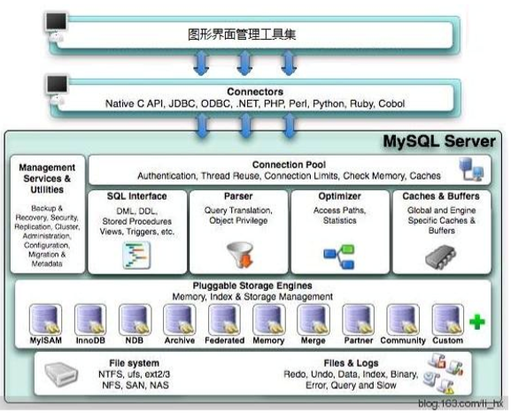
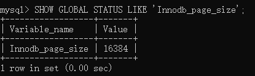
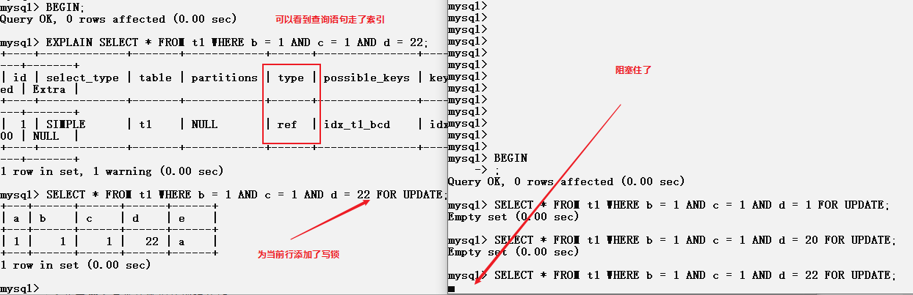

# mysql相关知识点

## 一、架构图



## 二、常见的存储引擎与区别

| 存储引擎 | 特点                                                         | 备注                                                         |
| -------- | ------------------------------------------------------------ | ------------------------------------------------------------ |
| InnoDB   | 1. 支持事务<br>2. 支持行级锁<br>3. 当插入数据时，默认会根据主键进行排序，若未指定主键则会自动生成一个row_id | 如果应用支持事务或需要执行大量的INSERT或UPDATE操作，则应该使用InnoDB |
| MyISAM   | 1. 不具备事务功能<br>2. 只支持表级锁<br>3. 数据插入顺序不变  | 如果应用中需要执行大量的SELECT查询，可以选择MyISAM           |
| Memory   | 数据不会存储到硬盘中，即重启后数据就会丢失                   | 不需要持久化则可以使用Memory                                 |

## 三、InnoDB存储引擎

* 为什么要单独总结InnoDB呢？因为它支持事务，就目前各种业务场景下，很多操作都是要求原子性的，这就体现到了事务的重要性。

### 3.1 InnoDB存储原理

* 数据会存储在硬盘上，在真正需要处理数据时，首先会把数据加载到内存中去。当进行查表时，InnoDB并不是一行一行的读取，在InnoDB中的数据大小单位叫`页`, 在mysql中可以使用如下命令查看页大小: **SHOW GLOBAL STATUS like 'Innodb_page_size';**

  

  默认页大小为**16384 byte**, 即`16kb`。对于mysql而言，不管是插入数据还是找出数据，都是以页为基本单位，也就是说，假设我们执行一条sql，它内部存储的内存大小小于`16kb`，此时mysql会继续将后面的数据也加载出来，因为mysql认为你可能后面会用到它们。

* 页结构

  

  通过上述图可知，固定部分已经占了**38 + 56 + 26 + 8 = 128字节**，相对于**16384字节**而言，微不足道。所以我们在mysql中存储的数据都是在`User Records`和`Free Space`两部分

### 3.2 InnoDB与MyISAM存储数据

* InnoDB与MyISAM建表与存储数据区别

  ```mysql
  --- 建表语句
  CREATE TABLE t1(
    a INT PRIMARY KEY,
    b INT,
    c INT,
    d INT,
    e VARCHAR(20)
  ) ENGINE=InnoDB;
  
  --- 初始化数据
  INSERT INTO t1 VALUES
  (4, 3, 1, 1, 'd'),
  (2, 2, 2, 2, 'b'),
  (6, 6, 4, 4, 'f'),
  (1, 1, 1, 1, 'a'),
  (3, 3, 2, 2, 'c'),
  (8, 8, 8, 8, 'h'),
  (5, 2, 3, 5, '3'),
  (7, 4, 5, 5, 'g'),
  (9, 2, 1, 9, 'j'),
  (10, 7, 4, 2, 'l');
  
  --- 建表语句
  CREATE TABLE t2(
    a INT PRIMARY KEY,
    b INT,
    c INT,
    d INT,
    e VARCHAR(20)
  ) ENGINE=MyISAM;
  
  --- 初始化数据
  INSERT INTO t2 VALUES
  (4, 3, 1, 1, 'd'),
  (2, 2, 2, 2, 'b'),
  (6, 6, 4, 4, 'f'),
  (1, 1, 1, 1, 'a'),
  (3, 3, 2, 2, 'c'),
  (8, 8, 8, 8, 'h'),
  (5, 2, 3, 5, '3'),
  (7, 4, 5, 5, 'g'),
  (9, 2, 1, 9, 'j'),
  (10, 7, 4, 2, 'l');
  ```

* 插入数据后的结果

  
  
* 结论：**InnoDB存储引擎在插入数据时会根据主键id进行升序排序。MyISAM存储引擎在插入数据时不会修改插入顺序。**

### 3.3 InnoDB聚簇索引索引

* 通过上述内容可以知道，InnoDB在存储数据时默认会按照主键排序，而在此过程中，mysql还做了一件事，就是建立了`聚簇索引`。此`聚簇索引`是一棵**B+树**。我们通过**[https://www.cs.usfca.edu/~galles/visualization/BPlusTree.html](https://www.cs.usfca.edu/~galles/visualization/BPlusTree.html)**网站，根据**t1**表中的主键构建了这样的一棵**B+树**，如下所示：

  

  可以看到，叶子节点中存储了`t1`表中所有的主键，其实在mysql构建这棵树中，它会存储其他的数据结构，于是，针对上述的数据结构，我重新绘制了一幅图：

   可以看到，每一个主键内部维护了剩下的数据部分，也就是当我们执行如下sql时：

  ```mysql
  SELECT * FROM t1 WHERE a = 2;
  ```

  它会先去**聚簇索引**产生的`B+`树去找a=2的节点，首先在根节点中，发现**2 < 5**，于是找左节点，发现**2 < 3**，于是又找3的左节点，此时就找到了2。这个时候就直接将节点2中附带的信息**222b**给返回出去了，所以此时，它走了索引。那么，**如何判断一个查询条件有没有走索引呢**？这个是由mysql中的**查询优化器**来决定的，对于**查询优化器**而言，它会判断`走索引以及走了索引后的回表操作`和`全表扫描`两种处理方式哪种方式耗时比较少。**ps: 这里涉及的查询优化器和回表操作的概念在后面会提到**

### 3.4 InnoDB二级索引(**辅助索引**)

* 通过上述描述可以知道，对于InnoDb存储引擎而言，在插入数据的时候会默认创建**聚簇索引**。假设我们需要为其他字段创建索引呢？此时这个索引叫**二级索引(辅助索引)**。为什么这么叫呢？请看下面的分析

* 假设我们要为bcd三个字段创建一个**联合索引**，同上，我们先统计下bcd字段的所有可能出现的值：**111、222、322、311、235、644、455、888、219、742、**，排序后就是`111 > 219 > 222 > 235 > 311 > 322 > 455 > 644 > 742 > 888`。同上，我们使用现有的工具[https://www.cs.usfca.edu/~galles/visualization/BPlusTree.html](https://www.cs.usfca.edu/~galles/visualization/BPlusTree.html)来构建b+树

  

  同理，mysql构建出来的B+树会在此基础上加点东西，如下图：

  

  由上可知，在bcd每个节点内部都维护了当前数据对应的主键，之所以叫做**辅助索引**，就是因为在mysql中，最终都会通过主键去找数据(因为完整的数据都是存在聚簇索引对应的B+树中，如果走了**覆盖索引**，则不需要回表了)，而我们自定义的索引中，内部维护了当前数据对应的主键，所以最后还会根据这个主键去走聚簇索引。**注意: 这里的每一个节点(数据页)被加载一次就会产生一次IO(试情况而定，总而言之MySQL每次IO操作都会携带16字节的数据，此时有可能包含好几个叶子节点，这取决于每个叶子节点的大小)，之前我们说过，InnerDB引擎中的数据单位为页，在图中可能没有体现出来**。上述所说的`回表`的概念就是：在辅助索引确认的情况下，还要根据辅助索引各节点中对应的主键到`聚簇索引`中去找对应的数据。

### 3.5 索引优缺点

* 一个原则：**一个索引对应一棵B+数**，

* 缺点：

  ```txt
  1. 当我们插入、更新数据的时候，mysql都要重新维护这棵B+树。
  2. 每一个节点就是一个页，所以还需要耗费磁盘中的空间来存储这些数据
  ```

* 优点：加快查询速度

### 3.6 索引实战

* **前提：存在bdc组合索引**，执行如下代码创建索引和10万条数据

  ```sql
  -- 创建存储过程
  CREATE PROCEDURE my_procedure()
  BEGIN 
    DECLARE n INT DEFAULT 10;
  	WHILE n < 100010 DO
  	  SET @a = 10 + n;
      SET @b = RAND() * 100000;
      SET @c = RAND() * 100000;
      SET @d = RAND() * 100000;
      SET @e = RAND() * 100000;
  	  INSERT INTO t1 VALUES(@a, @b, @c, @d, @e);
      SET n = n + 1;
  	END WHILE;
  END;
  
  -- 调用存储过程插入数据
  CALL my_procedure()
  
  -- 创建索引
  ALTER TABLE t1 ADD INDEX index_b_c_d(b, c, d);
  ```

* 有了上述图之后，其实一个查询语句有没有走索引就变得很简单了。

* `以下说的走索引只能说有对应的索引存在，具体查询过程中能不能走，还要根据查询优化器得出的结论而言。这里咱们可以做一个猜测，具体的能否走索引，咱们还要根据EXPLAIN关键字来分析`

  ```mysql
  -- 1. 不用说，本来联合索引就是根据bcd来的，肯定会走索引，由于是select *, 在bcd索引树中只存在主键和bcd的数据，由于表中还存在e字段，因此为了获取这个e字段，还需要进行回表操作
    EXPLAIN SELECT * FROM t1 WHERE b = 1 AND c = 1 AND d = 1;
  
  -- 2. b = 1, 可以根据索引定位到b=1的一些节点(页)，所以也是可以走索引的
    EXPLAIN SELECT * FROM t1 WHERE b = 1
    
  -- 3. 走不了索引，因为只凭一个c mysql无法确认需要定位到节点(页)
    EXPLAIN SELECT * FROM t1 WHERE c = 1
    
  -- 4. 无法走索引，bcd索引是按照bcd的顺序来搭建的b+树，要定位一个节点(页)，首先必须要定位到b的具体的值或范围
    EXPLAIN SELECT * FROM t1 WHERE b LIKE '%111%';
  
  -- 5. 可以走索引，因为能确定b的一些范围  ->  能确定一些节点
    EXPLAIN SELECT * FROM t1 WHERE b > 1 and b < 20;
    
  -- 6. 能走索引，因为能先根据b > 1 定位到一些节点
    EXPLAIN SELECT * FROM t1 WHERE b > 1 and c > 1;
    
  -- 7. 可以走索引，因为bcd索引对应的b+树就是根据b、c、d字段升序排列的
    EXPLAIN SELECT * FROM t1 ORDER BY b, c, d;
  
  -- 8. 不能走索引
    EXPLAIN SELECT * FROM t1 ORDER b, d, c;
    
  -- 9. 不能走索引
    EXPLAIN SELECT * FROM t1 ORDER BY b, c ASC, d DESC;
  ```

* 总结:

  ```txt
  上述说的走索引只能说有对应的索引存在，具体查询过程中能不能走，还要根据查询优化器得出的结论而言。有可能有些语句能走存在的索引，但是查询优化器觉得走索引要花费的时候可能还比全表扫描花费的时间要长。此时最终执行的结果可能是全表扫描
  ```

### 3.7 mysql查询优化器

* 上面说到了，**有索引能走至于最后到底走不走还是由mysql的查询优化器决定的**，下面我们来了解下mysql的查询优化器

* 如何查看执行一条sql的查询优化器的具体操作呢？

  步骤如下：

  ```txt
  1. 执行如下命令SET optimizer_trace="enabled=on";打开查询优化器的日志追踪功能
  2. 执行一条sql
  3. 运行如下命令:
     SELECT trace FROM information_schema.OPTIMIZER_TRACE;
  ```

* 案例：分析`select * from t1 where b = 1 and c > b;`语句的查询优化器日志，最终会得到如下信息：

  ```json
  trace: {
    "steps": [
      {
        "join_preparation": {
          "select#": 1,
          "steps": [
            {
              "expanded_query": "/* select#1 */ select `t1`.`a` AS `a`,`t1`.`b` AS `b`,`t1`.`c` AS `c`,`t1`.`d` AS `d`,`t1`.`e` AS `e` from `t1` where ((`t1`.`b` = 1) and (`t1`.`c` > `t1`.`b`))"
            }
          ]
        }
      },
      {
        "join_optimization": {
          "select#": 1,
          "steps": [
            {
              "condition_processing": {
                "condition": "WHERE",
                "original_condition": "((`t1`.`b` = 1) and (`t1`.`c` > `t1`.`b`))",
                "steps": [
                  {
                    "transformation": "equality_propagation",
                    "resulting_condition": "((`t1`.`c` > 1) and multiple equal(1, `t1`.`b`))"
                  },
                  {
                    "transformation": "constant_propagation",
                    "resulting_condition": "((`t1`.`c` > 1) and multiple equal(1, `t1`.`b`))"
                  },
                  {
                    "transformation": "trivial_condition_removal",
                    "resulting_condition": "((`t1`.`c` > 1) and multiple equal(1, `t1`.`b`))"
                  }
                ]
              }
            },
            {
              "substitute_generated_columns": {
              }
            },
            {
              "table_dependencies": [
                {
                  "table": "`t1`",
                  "row_may_be_null": false,
                  "map_bit": 0,
                  "depends_on_map_bits": [
                  ]
                }
              ]
            },
            {
              "ref_optimizer_key_uses": [
                {
                  "table": "`t1`",
                  "field": "b",
                  "equals": "1",
                  "null_rejecting": false
                }
              ]
            },
            {
              "rows_estimation": [
                {
                  "table": "`t1`",
                  "range_analysis": {
                    "table_scan": {
                      "rows": 10,
                      "cost": 5.1
                    },
                    "potential_range_indexes": [
                      {
                        "index": "PRIMARY",
                        "usable": false,
                        "cause": "not_applicable"
                      },
                      {
                        "index": "idx_t1_bcd",
                        "usable": true,
                        "key_parts": [
                          "b",
                          "c",
                          "d",
                          "a"
                        ]
                      }
                    ],
                    "setup_range_conditions": [
                    ],
                    "group_index_range": {
                      "chosen": false,
                      "cause": "not_group_by_or_distinct"
                    },
                    "analyzing_range_alternatives": {
                      "range_scan_alternatives": [
                        {
                          "index": "idx_t1_bcd",
                          "ranges": [
                            "1 <= b <= 1 AND 1 < c"
                          ],
                          "index_dives_for_eq_ranges": true,
                          "rowid_ordered": false,
                          "using_mrr": false,
                          "index_only": false,
                          "rows": 1,
                          "cost": 2.21,
                          "chosen": true
                        }
                      ],
                      "analyzing_roworder_intersect": {
                        "usable": false,
                        "cause": "too_few_roworder_scans"
                      }
                    },
                    "chosen_range_access_summary": {
                      "range_access_plan": {
                        "type": "range_scan",
                        "index": "idx_t1_bcd",
                        "rows": 1,
                        "ranges": [
                          "1 <= b <= 1 AND 1 < c"
                        ]
                      },
                      "rows_for_plan": 1,
                      "cost_for_plan": 2.21,
                      "chosen": true
                    }
                  }
                }
              ]
            },
            {
              "considered_execution_plans": [
                {
                  "plan_prefix": [
                  ],
                  "table": "`t1`",
                  "best_access_path": {
                    "considered_access_paths": [
                      {
                        "access_type": "ref",
                        "index": "idx_t1_bcd",
                        "rows": 1.4286,
                        "cost": 1.7143,
                        "chosen": true
                      },
                      {
                        "rows_to_scan": 1,
                        "access_type": "range",
                        "range_details": {
                          "used_index": "idx_t1_bcd"
                        },
                        "resulting_rows": 1,
                        "cost": 2.41,
                        "chosen": false
                      }
                    ]
                  },
                  "condition_filtering_pct": 100,
                  "rows_for_plan": 1.4286,
                  "cost_for_plan": 1.7143,
                  "chosen": true
                }
              ]
            },
            {
              "access_type_changed": {
                "table": "`t1`",
                "index": "idx_t1_bcd",
                "old_type": "ref",
                "new_type": "range",
                "cause": "uses_more_keyparts"
              }
            },
            {
              "attaching_conditions_to_tables": {
                "original_condition": "((`t1`.`b` = 1) and (`t1`.`c` > 1))",
                "attached_conditions_computation": [
                ],
                "attached_conditions_summary": [
                  {
                    "table": "`t1`",
                    "attached": "((`t1`.`b` = 1) and (`t1`.`c` > 1))"
                  }
                ]
              }
            },
            {
              "refine_plan": [
                {
                  "table": "`t1`",
                  "pushed_index_condition": "((`t1`.`b` = 1) and (`t1`.`c` > 1))",
                  "table_condition_attached": null
                }
              ]
            }
          ]
        }
      },
      {
        "join_execution": {
          "select#": 1,
          "steps": [
          ]
        }
      }
    ]
  }
  ```

  分析：

  * **join_preparation**阶段(预准备阶段)

    

    ```json
    {
        "join_preparation": {
            "select#": 1,
            "steps": [
                {
                    "expanded_query": "/* select#1 */ select `t1`.`a` AS `a`,`t1`.`b` AS `b`,`t1`.`c` AS `c`,`t1`.`d` AS `d`,`t1`.`e` AS `e` from `t1` where ((`t1`.`b` = 1) and (`t1`.`c` > `t1`.`b`))"
                }
            ]
        }
    }
    
    //此阶段一般是对sql语句进行整理，即内部会为变量添加别名、标识字段属于哪个表等等
    ```

  * **join_optimization**阶段

    ```json
    // 此阶段为优化阶段，涉及的部分比较多，但只需要查看最终要的"rows_estimation"部分即可:
    {
        "rows_estimation": [
            {
                "table": "`t1`",
                "range_analysis": {
                    // 全表扫描的成本
                    "table_scan": {
                        "rows": 10,
                        // 权重为 5.1
                        "cost": 5.1  
                    },
                    // 可能存在的范围索引
                    "potential_range_indexes": [ 
                        {
                            "index": "PRIMARY",
                            // 表示主键索引不可用
                            "usable": false,  
                            "cause": "not_applicable"
                        },
                        {
                            "index": "idx_t1_bcd",
                            // 表示可以使用此索引
                            "usable": true, 
                            "key_parts": [
                                "b",
                                "c",
                                "d",
                                "a"
                            ]
                        }
                    ],
                    "setup_range_conditions": [
                    ],
                    "group_index_range": {
                        "chosen": false,
                        "cause": "not_group_by_or_distinct"
                    },
                    // 分析idx_t1_bcd索引
                    "analyzing_range_alternatives": { 
                        "range_scan_alternatives": [
                            {
                                "index": "idx_t1_bcd",
                                "ranges": [
                                    "1 <= b <= 1 AND 1 < c"
                                ],
                                "index_dives_for_eq_ranges": true,
                                "rowid_ordered": false,
                                "using_mrr": false,
                                "index_only": false,
                                "rows": 1,
                                // 发现最后的权重为2.21
                                "cost": 2.21,  
                                "chosen": true
                            }
                        ],
                        "analyzing_roworder_intersect": {
                            "usable": false,
                            "cause": "too_few_roworder_scans"
                        }
                    },
                    // 最终决定使用什么策略，看是使用全表扫描还是索引，如果自己认为MySQL查询优化器使用索引的策略并不是最优解，可以强制在SQL的FROM table后面添加USE + 索引名的方式指定使用哪一个索引
                    "chosen_range_access_summary": {  
                        "range_access_plan": {
                            "type": "range_scan",
                            "index": "idx_t1_bcd",
                            "rows": 1,
                            "ranges": [
                                "1 <= b <= 1 AND 1 < c"
                            ]
                        },
                        "rows_for_plan": 1,
                        "cost_for_plan": 2.21,
                        "chosen": true
                    }
                }
            }
        ]
    }
    ```

    通过`chosen_range_access_summary`中的结果，最终使用的是**idx_t1_bcd**索引，而且是通过**范围**查找的。

  * 其他部分显得不那么重要了，直接忽略。。。。

* 如何做决策？该进行全表扫描还是走索引?

  在mysql中，有一个约定俗成的规定：如果要加载一个页(16KB)的数据，则需要`1`(可以理解成一个权重)，如果要读取一行数据则需要`0.2`。所以，针对查询优化器而言，它每次查询时需要确认全表扫描的权重，其次再根据具体条件去确定扫描所需的权重(如果是辅助索引的话，扫描时间还要包含回表的的时间)。最终将全表扫描得出的权重与根据条件查询得出的权重进行比较，权重小的方案获胜.

  * 全表扫描权重计算公式：`全表扫描成本 = 表中数据所占的页数 * 1 + 行数 * 0.2`

    * 使用如下命令查看表中的详细信息(包括数据长度等信息):

      ```mysql
      -- 此表有可能会出现数据不同步的情况，因为在mysql中，如果修改的数据超过整体的百分之10的话，mysql会开一个线程去同步SHOW TABLE STATUS LIKE '表名';命令的结果
      -- 除此之外，mysql还支持手动同步，同步命令: 
      -- ANALYZE TABLE '表名'
      SHOW TABLE STATUS LIKE '表名';
      ```

      

      所以t1表的全表扫描的成本为：`Data_length / 16384 * 1 + Rows * 0.2 = 16384/16384 * 1 + 10 * 0.2 = 3`  即全表扫描时的权重为`3`  => 这里为什么会与上述的`table_scan`得出的全表扫描权重`5.1`不一致呢？`这里待确认为什么会这样？？？？？？？？？？`。不过按照上述mysql自己输出的记录来看，最终走的是`idx_t1_bcd`索引，类型为`range_scan`。使用explain查看如下：

      


## 四、外链接原理

### 4.1 几种常见外链接原理

* 内连接原理

  ```mysql
  -- 如下sql
  SELECT * FROM t1, t2;
  SELECT * FROM t1 join t2;
  SELECT * FROM t1 INNER JOIN t2;
  ```

  对于上述所列出的sql全是属于内连接的。按照咱们了解的原理来解释，先从t1表取出来第一条数据，然后挨个去和t2表的每条数据进行组合，**类似于嵌套循环**。所以最终筛选出来的数据条数为：**t1的条数 * t2的条数**  --- `笛卡尔积`

* 但是，还记得mysql中的基本单位叫页么？同时mysql中有一个叫`join buffer`的概念，在mysql中，一个`joib buffer`的大小为**256kb**。所以在进行join查询时，每次会读取`256kb / 16KB = 16页`的数据。最后再根据筛选出来的16页的数据(**驱动表的数据 -> 主表的数据**)去另外一个表中去查。这里进而体现出来了优化join的查询效率的方案：`提高join buffer的大小`，可以修改**join_buffer_size**的值来增加每次join查询出来的页的大小，进而减少磁盘io

* 左连接原理

  ```mysql
  -- 如下sql
  SELECT * FROM t1 LEFT JOIN t2 ON t1.a = t2.a;
  ```

  对于此条sql中，所述的连接类型为左连接。左连接有个特点，即**必须要指定一个连接条件**，否则编译会报错。在此处指定的条件为**t1.a = t2.a**。按照咱们了解的原理来解释，因为是左连接，所以左边的是主表。所以会先筛选出t1表中的a。然后再执行类型sql

  ```mysql
  SELECT * FROM t2 WHERE a = t1.a
  ```

  于是有如下伪代码:

  ```java
  for (var a : (SELECT a FROM t1)) {
      SELECT * FROM t2 WHERE t2.a = a;
  }
  ```

* 右连接原理

  ```mysql
  -- 如下sql
  SELECT * FROM t1 RIGHT JOIN t2 ON t1.a = t2.a;
  ```

  与左连接原理差不多，区别就是先查出右边表(t2)的a，然后再查t1的a与t2的a相等的数据

## 五、事务

### 5.1 ACID

* A(Atomicity)：**原子性：两个操作要么都成功要么都失败**
* C(Consistency)：**一致性：业务中的操作，最终的数据要统一**
* I(isolation)：**隔离性：两个不同业务的操作不受影响**
* D(Durability)：**持久性：操作结果不变，永久保存**

### 5.2  如何开启事务

* 在mysql中，事务是默认开启的，可以执行`SHOW VARIABLES LIKE 'autocommit'`语句查看，默认是开启的。即我们使用**update、insert、delete**语句时，mysql会默认开启事务和提交事务。若想手动的提交，则需要关闭`autocommit`属性(**SET autocommit = 0**)，然后显示的使用**begin或者start transaction**和**commit**以及**rollback**来开启一个事务和提交一个事务以及回滚一个事务。

### 5.3 隐式提交

* 当mysql中的事务不是非自动提交时。假设我们使用**begin或者start transaction**开启一个事务而没有执行`commit`或`rollback`操作时。当我们执行一些特定的操作时，会触发**隐式提交**机制。具体触发的操作如下：

  ```txt
  1. 触发DDL操作(数据库对象的数据定义语言)，即使用CREATE, ALTER, DROP命令去操作数据库、表、试图、存储过程时
  2. 修改mysql中mysql数据库中的表，即使用ALTER USER, CREATE USER, SET PASSWORD等等。最常见的就是设置root用户的允许远程连接的ip地址，这个操作修改的是mysql数据库中的user表
  3. 重复使用begin或start transaction提交事务。那么会默认将上一个未提交的事务提交
  4. 在autocommit为false时，此时若手动设置autocommit为true，那么也会触发隐式提交
  5. 显示的使用LOCK TABLE、UNLOCK TABLE来锁表和解锁表的操作时，隐式提交也会触发
  6. 当我们使用LOAD DATA语句时，也会触发隐式提交
  7. ANALYZE TABLE, CACHE INDEX, CHECK TABLE, FLUSH, LOCAD INDEX INTO CACHE, OPTIMIZE TABLE, REPAIR TABLE, RESET语句的使用也会触发隐式提交
  ```

### 5.4 隔离(ISOLATION)级别

* 读未提交(READ UNCOMMITTED)

  ```txt
  当事务设置成了读未提交的级别(会话级别的设置：set session transaction isolation level read uncommitted;)
  即一个事务修改了一条数据还未提交，但此时另外一个connect来读取这个条数。此时读取的是更新后的数据。这个时候是脏读，为什么呢？因为有可能上一个事务后续还会对这个数据进行操作。
  
  具体流程如下:
  开启两个mysql的客户端，并分别设置隔离级别为：读未提交，且设置两个客户端的autocommit为false
  SET autocommit = 0;   
  SET SESSION TRANSACTION ISOLATION LEVEL READ UNCOMMITTED; 
     --> 可以使用select @@session.tx_isolation;查看当前会话事务隔离级别
  UPDATE t1 SET d = 2 WHERE a = 1;操作
  当另外一个连接执行SELECT d FROM t1 WHERE a = 1;时，得到的d的数据是2。
  
  ===>  产生了脏读
  ```

  脏读的应用场景：在我们进行开发大保存功能时，需要进行测试，此时可以在MySQL客户端的当前会话的隔离级别设置为**读未提交**，此时就能在执行完某张表的插入操作后，就能立马在当前会话中看到插入的数据，当事务回滚时，数据也会进行回滚。

* 读已提交(READ COMMITTED)

  ```txt
  只有事务把修改的数据提交了，其他的事务才能读取到已修改的数据。但这样会出现幻读的情况。即事务A一开始查询的数据数量为10条，但是事务B插入了一条数据后。事务A再进行查询，就会发现11条数据。
  即，在读已提交的事务级别下，其他的事务对数据进行了增加或者删除的操作并commit了，此时其他事务去读取数据，就会出现幻读的情况。
  
  具体流程如下：
  开启两个mysql的客户端，并分别设置隔离级别为：读已提交，且设置两个客户端的autocommit为false
  SET autocommit = 0;
  SET SESSION TRANSACTION ISOLATION LEVEL READ COMMITTED;
  在事务客户端a中执行:
    SELECT * FROM t1;  此时只有10条数据
  在事务客户端b中执行:
    begin;
    INSERT INTO t1 values(11, 2, 4, 5, 'd');
    commit;
  在事务客户端a中执行
    SELECT * FROM t1;  此时只有11条数据
  
  同时在读未提交的隔离机制中也会出现幻读的情况
  ```

  `读已提交的事务隔离机制原理`：/

  * 在mysql中，每行数据除了基本的字段外，还会额外存储**row_id, transaction_id, roll_pointer**三个字段。所以针对t1表的每条记录在修改数据时，mysql会存储一些类似如下的内容：

  * 详见下图：

    

* 可重复读(REPEATABLE READ)

  ```txt
  在同一个事务中，若自己没有对数据修改，那么读取的数据不会变，即重复读。--- 在可重复读隔离级别中把幻读给解决了
  ```

  `可重复读的事务隔离机制原理`：

  与**读已提交**的原理差不多，但是区别在于`ReadView`，在**读已提交**的隔离机制中，同一个事务下每执行一次select时，都会更新`ReadView`的数据，也就是说，若中途有事务提交了，`ReadView`中的数据就会减少。而**可重复读**的隔离机制中，同一个事务，不管是select多少次，用的是第一次的`ReadView`，这也就刚好能证明它的可重复读特性了。因为就算其他事务提交了，但是我select时的`ReadView`没有被更新，所以不会读取最新的数据。

* 串行化(SERIALIZABLE)

  ```txt
  指定对同一条记录的顺序执行
  ```

* **总结**

  | 隔离机制 |                         特点(及原理)                         | 存在的问题 |
  | :------: | :----------------------------------------------------------: | :--------: |
  | 读未提交 | 1. 两个事务未提交也能互相读取到修改的数据  -- 脏读<br>2. 一个事务插入或修改数据，另外一个事务也能获取到  --- 幻读 | 脏读、幻读 |
  | 读已提交 | 1. 两个事务，只要其中有一个事务做出了commit操作，另外一个事务也能获取到 --- 幻读<br> |    幻读    |
  | 可重复读 | 1. 两个事务互相隔离，完全不同的两个世界，你做你的事，我做我的事，互相不影响。你修改数据，commit了，我也获取不到你修改后的数据  --- 可重读 |    暂无    |

## 六、锁

### 6.1 mysql锁的分类

* 读锁：在mysql中每条记录可以有多个读锁

  手动添加一个读锁：

  ```sql
  SELECT * FROM t1 WHERE a = 1 LOCK IN SHARE MODE;
  ```

* 写锁：在mysql中每条记录最多只能存在一个写锁

  手动添加一个写锁：

  ```mysql
  SELECT * FROM t1 WHERE a = 1 FOR UPDATE;
  ```

* 上述的**读/写锁**的特点不会因mysql的事务隔离机制变化而变化

* **重复加行锁 + 另一个事务在行锁中添加写锁**

  

  可以看到，重复添加读锁是没问题的，但是在读锁中添加行锁，此时会`阻塞`

* **重复加行锁 + 当前事务添加写锁**

  

* **不同事务中添加写锁**

  

* 针对上述写锁和读锁，在每个事务隔离机制中，同一个事务中可以任意操作，不同事务之间是遵循上述**读/写锁**原则的。同时，只有显示的添加了`LOCK IN SHARED MODE`或`FOR UPDATE`加锁关键字才算加锁，正常的`SELECT * FROM table`跟锁没有任何联系的，就算表中某一行添加了写锁，我依然能够访问，见下图：

  

### 6.2 mysql中delete + insert + update三个操作上锁机制

* **DELETE：先给记录加写锁，再执行删除操作**

* **INSERT: 会先加隐式锁来保护这条新插入的记录，来保证这条记录不会被其他事务给访问**

  ```txt
  隐式锁：类似于悲观锁，在插入一条记录是，会记录事务id，当其他事务来操作这条记录时，发现事务id不对，这时会添加一把写锁。
  ```

* **UPDATE：会先给记录加x锁，再直接对记录进行修改**

### 6.3 行锁类别

* **LOCK_REC_NOT_GAP：锁单个记录**
* **LOCK_GAP：间隙锁，锁定一个范围，不包括自己**
* **LOCK_ORDINARY：锁定一个返回，包括自己，间隙锁的升级版**

### 6.4 各事务隔离机制的行锁对比

* **读已提交(READ COMMITTED)事务级别的行锁**

  1. 对`主键`所处的行进行锁定

     

     

     `结论：当锁住的sql语句走了聚簇索引(主键)时，锁住的只是一行`

  2. 对辅助索引所处的行进行锁定

     

     

     

     `总结:所以走辅助索引，最终也是锁了行，但是按照咱们之前的知识，每个主键都会对应一颗B+树，辅助索引最终会进行回表操作。当我们执行SELECT * FROM t1 WHERE a = 1;的sql语句时，其实它走的索引是**聚簇索引**， 但是它也阻塞了，由此可以证明辅助索引锁住的行，最终也会把聚簇索引也锁住`

  3. 不走任何索引的情况

     

     

     

     `总结：由此可见，对于READ COMMITTED读可提交的事务级别不走任何索引的情况，锁住的也是当前行`

* **REPEATABLE READ可重复读事务级别的行锁**

  1. 对`主键`所处的行进行锁定 ---- 与**READ COMMITTED的事务级别一样**
  2. 对辅助索引所处的行进行锁定 ---- 与**READ COMMITTED的事务级别一样**
  3. 不同于**READ COMMITTED的事务级别**。在此情况下，`此事务级别将全表进行锁定`

## 七、Explain分析sql语句

* Explain关键字结果各字段含义

  |     字段      |                             含义                             |
  | :-----------: | :----------------------------------------------------------: |
  |      id       | 查询语句每出现一个关键字，就会有它对应的id。<br />1.在连表查询时，所有的id都一样。<br />2.在子查询时，每个id都不一样(视查询优化器的优化结果而言，因为查询优化器有可能对子查询进行重写) |
  |  select_type  |                    SELECT关键字对应的类型                    |
  |     table     |                         涉及到的表名                         |
  |  partitions   |                           分区信息                           |
  |     type      |                     针对table的访问方式                      |
  | possible_keys |                        可能用到的索引                        |
  |      key      |                        实际用到的索引                        |
  |    key_len    |                     实际用到的索引的长度                     |
  |      ref      |    当对索引进行等值查询时，与索引列进行等值匹配的对象信息    |
  |     rows      |                      预估需要读取的行数                      |
  |   filtered    |        当前表经过条件筛选了，过滤掉了百分之多少的数据        |
  |     extra     |                           额外信息                           |

### 7.1 详解id

#### 7.1.1 连表查询下的id

* 不管是内连接、左连接、外链接，最终分析出来的id都是同一个

  ```SQL
  -- 内连接
  EXPLAIN SELECT * FROM t1, t2;
  EXPLAIN SELECT * FROM t1 JOIN t2;
  EXPLAIN SELECT * FROM t1 INNER JOIN t2;
  EXPLAIN SELECT * FROM t1 FULL JOIN t2;
  
  -- 左外连接
  EXPLAIN SELECT * FROM t1 LEFT JOIN t2 ON t1.a = t2.a;
  
  -- 右外连接
  EXPLAIN SELECT * FROM t1 RIGHT JOIN t2 ON t1.a = t2.a;
  ```

* 这里展示下左外链接下的explain结果(**出现在第一行的是驱动表，第二行的是被驱动表**)

  

#### 7.1.2 子查询下的id

* 一般情况下， 子查询中有几个select就会出现几个id，如下图所示（查询t1表有两个条件，其中条件1是来源于子查询的结果，条件2为自身表字段的结果）

  .png)

* 但有特殊情况，查询优化器会对子查询做优化，有可能会对子查询优化成一个连接查询，如下所示：

  .png)

* 分析：可以看到id都是1，也就是优化成了**连接查询**了

#### 7.1.3 union下的id

* 先总结下`UNION`关键字的含义：此关键字可以将两个表的结果以垂直方向拼接，但要求两个结果查出来的列的数据类型、列的数量一致。但它有一个特点：`会过滤掉重复的数据`

* `UNION`关键字下的执行计划：

  

* 分析：可以看到它有三个id，分别为1、2、null。为什么会有null？那是因为union关键字。因为union具有去重功能，所以它需要开一个临时表(如上所示，名字叫`union1,2`)来完成去功能。

#### 7.1.4 union all下的id

* 再总结下`UNION ALL`关键字的含义：与`UNION`关键字类似，但是它的特点是不会过滤掉重复的数据。

* `UNION ALL`关键字下的执行计划：

  

* 分析：可以发现它的id只有两个，没有了id为null的行。这也和它的功能有关，因为它不需要去重，所以压根没必要创建临时表。

### 7.2 详解select_type

* 对应当前表在当前查询起的作用，用[####7.1.4 union all下的id](####7.1.4 union all下的id)章节的图来说明问题，在t1和t2进行union all查询时，t2占据的类别为union，t1是primary。也就是将t2查询出来的结果放在t1后面。

* 可取的值

  | select_type可取的值 |                             含义                             |
  | :-----------------: | :----------------------------------------------------------: |
  |       primary       | **union**/**union all**/**in**关键字查询下的才会出现，表示为主表 |
  |        union        |              拼接在select_type为primary的表下面              |
  |       simple        |      不包含子查询和union查询的select_type一般都是simple      |
  |    union result     |       在使用union关键字查询时才会出现，临时表才会出现        |
  |      subquery       | 非相关子查询下才会出现。所谓非相关子查询就是先执行子查询，再执行主查询<br />1.相关子查询：select * from dept d1 where exists(select * from emp e1 where e1.deptno=d1.deptno);<br />2.非相关子查询：select * from emp where EMPNO in (select mgr from emp);<br />非相关子查询的sql只会执行一次 |
  | dependent subquery  | 相关子查询下才会出现，上面说了。相关子查询就是先执行主查询，在根据主查询的每一条记录去查询具体的值。 |

### 7.3 详解type

* type表示访问当前表的一种方式，一般可以从此属性中看sql是否走索引

  | type可取值  |                             含义                             |
  | :---------: | :----------------------------------------------------------: |
  |   system    | 当表中只有一条记录，并且该表使用的存储引擎是MyISAM, Memory，那么对该表的访问方式就是system。 |
  |    const    | 当我们使用主键或者唯一二级索引列与常数进行等值匹配时，对表的访问方式就是const。<br>验证sql: explain select * from t1 where a = 1; |
  |   eq_ref    | 在连接查询时，如果被驱动表是通过主键或者唯一二级索引等值匹配的方式进行访问的，那么对被驱动表的访问方式就是eq_ref：<br>验证sql: explain select * from t1 join t2 on t1.a = t2.a; |
  |     ref     | 当通过普通的二级索引列与常量进行等值匹配时来查询某个表，那么对该表的访问方法就可能是ref<br>验证sql: explain select * from t1 where b = 1; (要为b添加索引) |
| ref_or_null | 当对普通的二级索引进行等值查找或者查找条件包含NULL的话，那么查找此表的方式就是ref_or_null<br>验证sql: explain select * from t1 where b = 1 or b is null;(要为b添加索引) |
  | index_merge | 索引合并，当聚簇索引和二级索引一起作为条件查询时，此时会进行索引合并。<br>验证sql: explain select * from t1 where a = 1 or b  = 1; |
  |    range    | 当对索引进行范围查找时，此时访问表的方式就是range。<br>验证sql: select * from t1 where a > ; |
  |    index    | 当我们可以使用覆盖索引，但需要扫描全部的索引记录时，该表的访问方法就是index。<br>验证sql：explain select b from t1; (要对b添加索引) |
  |     all     |                           全表扫描                           |
  
  


