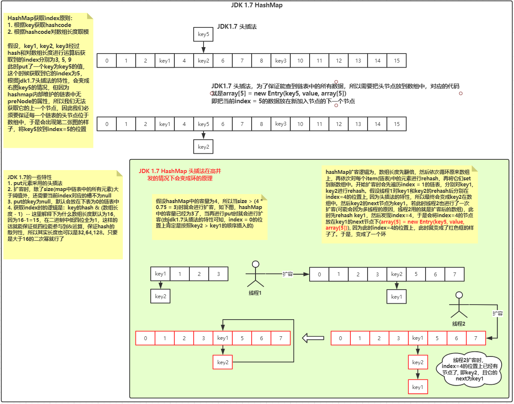

## 一、java基础相关

### 1.1 聊聊jdk的集合

#### 1.1.1 ArrayList

* ArrayList底层是一个可扩展的数组，在内存中是一段连续的空间，所以查询效率比较快。当我们默认new一个ArrayList时，`默认的数组容量是10`，同时我们也能指定数组长度，但这只是定义了数据的一个长度，并不是它的实际长度。它的实际长度是由它内部一个叫size的属性维护的。在调用它的add方法时，首先会去判断容量是否足够，size + 1的长度大于数组的长度时，此时就会进行扩容，`扩容为原来的1.5倍`，然后把原来的数组copy过去。`arrayList添加元素至指定下标的add方法和remove方法都是通过移动数组的方式实现的`。当需要把某个元素插入到某个下标时，arrayList是将当前下标及其后面的所有元素都往后挪一个位置。就是将数组拷贝到index + 1的位置上。remove时也差不多，是将index + 1以及后面的所有元素copy成一个数组，然后把这个数组放在index的位置上，完成remove操作。
* 同时`ArrayList的迭代器是fast-fail`（见源码：java.util.AbstractList#modCount），当我们在使用迭代器遍历的过程中若直接对数组进行了remove操作，此时会抛出ConcurrentModifiedException，此时我们应该要使用`迭代器`来执行remove操作来避免此异常的发生。它是非线程安全的，所以在多线程中，我们可以选择**vector、Collections.synchronizedList()和juc包下的CopyOnWriteArrayList**; 前两者差距都差不多，都是在方法处添加了synchronized关键字保证同步，而juc下的CopyOnWriteArrayList保证线程安全的原理是：内部使用了**ReentrantLock来保证线程安全，换言之就是使用AQS保证的线程安全**。同时`vector扩容是原来的两倍`，跟ArrayList不同。

#### 1.1.2 HashMap & ConcurrentHashMap

* Hash表，是一个时间复杂度为O(1)的数据结构，在等值查找的过程中具有特别大的优势。在jdk 1.7版本中，HashMap内部结构是**Hash表 + 链表**组成的，也就是俗称的`拉链法`。在jdk1.7中，一个hashMap默认的大小为**16**，扩容负载因子为**0.75**（**`引发问题1：扩容负载因子为什么是0.75`**），即当集合中的元素大于阈值**16 * 0.75 = 12**时，将要进行扩容，扩容为当前长度的**2倍**，此时因为jdk1.7在put元素采用的是头插法，这就导致如果在扩容的那一瞬间有多个请求同时对hashMap进行扩容，此时就会出现**环**的情况，即出现死循环（**`引发问题2：描述生成环的细节？`**）。在扩容的过程中，需要对原来的hashMap中的数组中的元素进行**rehash**，因为使用hash会出现hash碰撞的问题，jdk的作者为了将数据均匀分布在hash表中，特意设计了一个hash算法: 调用key的hashCode（**`引发问题3：为什么重写了HashCode后还要重写equals方法？`**）方法做完一系列操作后得出一个hash值最后再与hashMap的默认长度减一(`16 - 1 = 15`)做&运算得出要放入新hash表中的下标。其中hashMap的长度也支持自定义，但是我们最好把它的长度设置成2的幂次方。因为(2的幂次方 - 1)得出的结果的二进制中低四位全为1，这样的话hash的结果完全取决于key的hash值，这就达到了hash均匀分布的效果。

* 在jdk1.8中，针对上述的高并发下会出现环、以及链表查询效率低的情况做了改进。首先的改进为：put元素的方式从头插法变成了尾插法，以及对链表的数据结构进行扩展。**当链表的长度大于8且数组的长度&gt;64**，才会转成红黑树（**`引发问题4：为什么使用红黑树？`**）。但是即使换成了尾插法，但是仍然不建议在高并发的情况下使用HashMap，就算避免了出现死循环的情况，但是仍然不可避免数据的线程安全。在高并发的情况下最好使用juc包下的ConcurrentHashMap。

* 在jdk1.7中，ConcurrentHashMap采用的是segment分段锁来保证线程安全的，为什么说segment是一个锁呢？因为它继承了ReentrantLock类，在ConcurrentHashMap中，数组中存储的是segment对象，而segment对象内部维护了一个叫HashEntry的数组，其实我们可以把HashEntry理解成hashMap中的hashEntry，内部的逻辑和hashMap类似。而在jdk1.8中，ConcurrentHashMap放弃了segment分段锁，选择了synchronized + cas的方式来保证线程安全（**`引发问题5：为什么1.6之后改用成synchronized关键字保证线程安全？`**）。

  > 1. **`引发问题1：扩容负载因子为什么是0.75`**
  >
  > 2. **`引发问题2：描述生成环的细节？`**
  >
  >    
  >
  > 3. **`引发问题3：为什么重写了HashCode后还要重写equals方法？`**
  >
  >    这里拿hashMap做个例子，在hashMap中，是基于key的hashCode的值做了一些处理得出了index，但是hashCode是一个hash算法，难免会出现hash碰撞的情况。当出现hash碰撞后，得到的都是同样的下标，那么我们要如何来区分现在存在index的元素和我现在正在要put的元素是否相等呢？没错，就是使用equals方法来判断。hashcode只能说明当前对象的hashcode值，并不能代表对象相同。
  >
  > 4. **`引发问题4：为什么使用红黑树？`**
  >
  >    因为hashMap作为一个优秀的集合，会有频繁的插入和查找的特性，插入效率最好的是链表，而对于链表的进化数据结构而言查询效率比较好的完全平衡二叉树，而红黑树就位于这两者之间
  >
  > 5. **`引发问题5：为什么1.6之后改用成synchronized关键字保证线程安全？`**
  >
  >    因为jdk在1.6之后对synchronized关键字做了优化，它有一个锁升级的过程

* 更多关于hashMap的八股文，详见[此文章（点击查看）](https://mp.weixin.qq.com/s/7I-5RL0Py-g8mP7lJol3Yg)

### 1.2 创建对象的几种方式

* new、反射、反序列化、clone、使用unsafe类

### 1.3 深拷贝与浅拷贝

* **浅拷贝：**创建一个新对象，然后将当前对象的非静态字段复制到该新对象，如果字段是值类型的，那么对该字段执行赋值；如果该字段是引用类型的话，则复制引用但不复制引用的对象。因此，**原始对象及其副本引用同一个对象**。
* **深拷贝：**创建一个新对象，然后将当前对象的非静态字段复制到该新对象，无论该字段是值类型的还是引用类型，都复制独立的一份。当你修改其中一个对象的任何内容时，都不会影响另一个对象的内容。
* **总结：**深拷贝中，两个对象互相独立，毫无任何关系。浅拷贝中，引用对象拷贝的是引用，指向的还是堆内相同的对象。

### 1.4 并发相关

#### 1.4.1 有哪些锁的种类

| 锁种类   | 特性                                                         |
| -------- | ------------------------------------------------------------ |
| 悲观锁   | 悲观锁的特点是认为无时无刻都会出现并发的情况，所以每次都会加锁 |
| 乐观锁   | 乐观锁的特点是认为每次执行的过程中都不会出现并发的情况       |
| 可重入锁 | 锁的可重入性，即获取到锁的线程可以再次进入相同锁锁住的同步代码 |
| 自旋锁   | 所谓自旋锁就是让一个线程空转，jdk中使用for(;;)的语法。其实就是个死循环，当拿到锁后再跳出循环 |
| 轻量锁   | 多个线程交替执行，比如synchronized关键字的轻量锁、reentrantLock的轻量锁。所谓轻量锁就是一个概念，一种情景：关键就在于多个线程交替执行。 为什么说ReentrantLock也是个轻量锁呢？若有两个线程交替使用reentanctLock的lock方法，此时aqs队列都没初始化，仅仅是交替抢占state资源 |
| 偏向锁   | 所谓偏向锁就是这把锁只偏向于一个线程。在jvm中偏向锁的功能默认是延迟4s的，可以添加**-XX:BiasedLockingStartupDelay=0**jvm参数来设置延迟加载为0或者在创建锁对象之前延迟4s。其中使用**-XX:+PrintFlagsFinal**参数可以查看到jvm中对偏向锁功能默认延迟的时间 |
| 重量锁   | 重量级锁为在一个线程持有锁的过程中，另外一个线程也来申请获取锁了，此时存在资源的竞争情况。 |

#### 1.4.2 cas是什么

* 全称Compare And Swap，是一种乐观锁。主要原理为：**依赖硬件层面的原子性来实现并发操作**。假设要对一个变量的值由1改成5.那么在更改的过程中，会对a做比较，假设a的值不是1，那么则不会做任何操作。反之将它修改为5。其中比较和替换是原子性操作，也就是说在比较的过程中或者比较完准备赋值的步骤中不会出现其它线程来赋值的操作。但这会引发一个ABA问题，假设线程A把1改成了5，线程B又把5改成了3。线程C又把3改成了1。要解决这个问题可以使用拥有版本号的Atomic类，比如**AtomicStampedReference**类，为每个版本添加了时间戳，这样就能知道变量有没有被改过了

